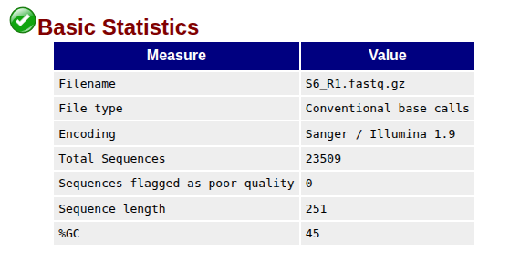
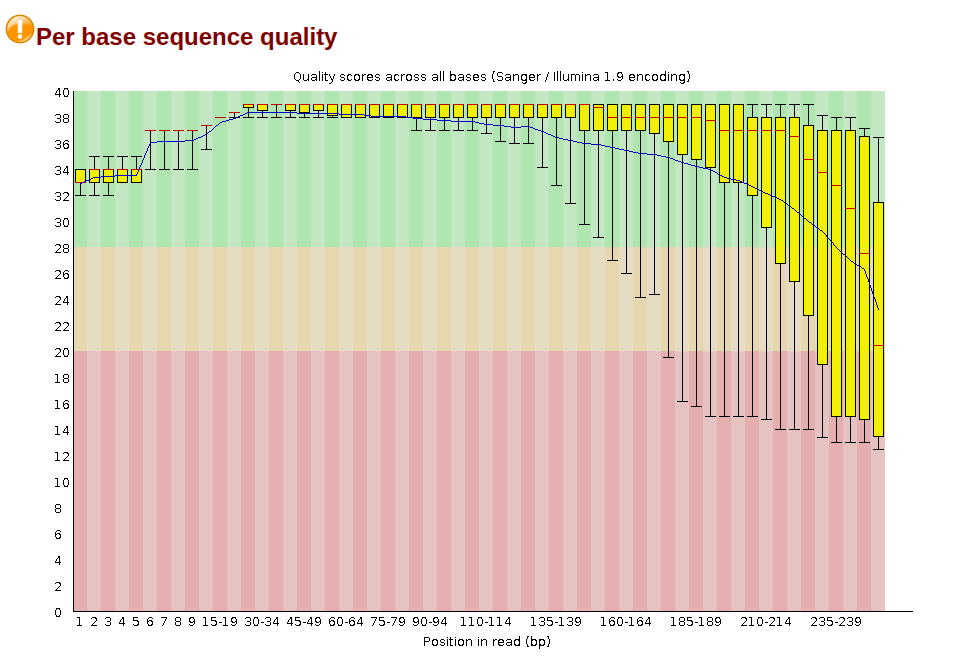
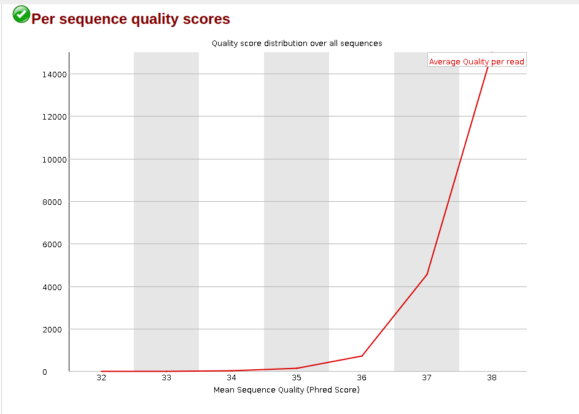
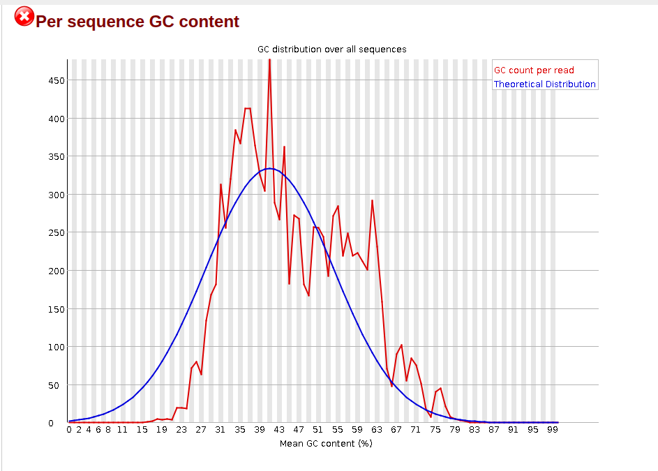
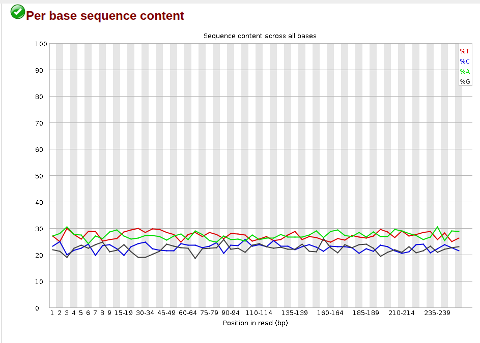
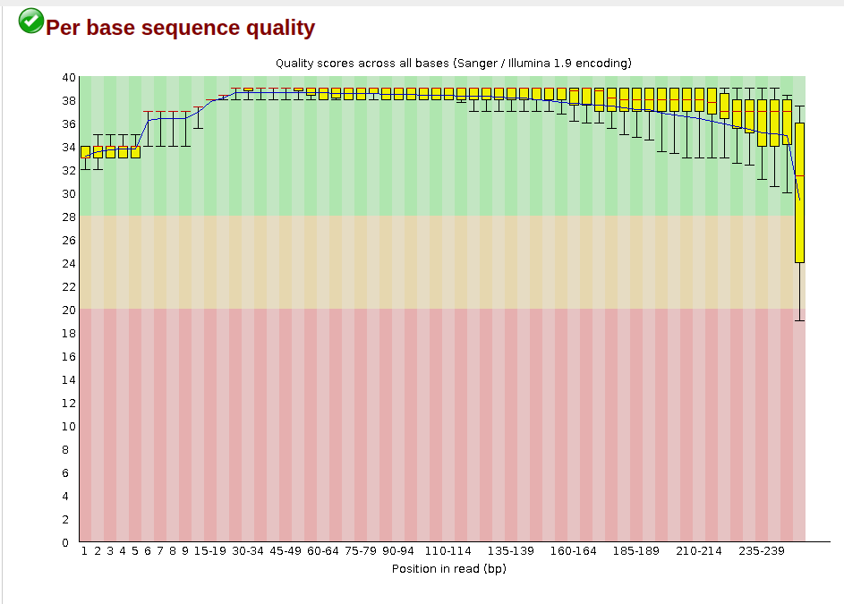
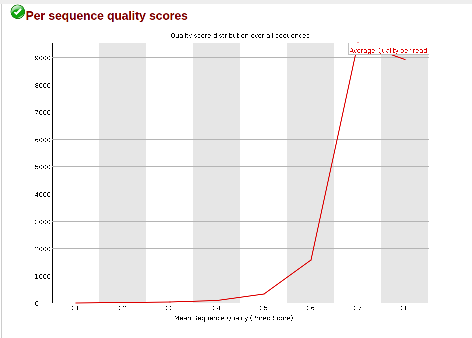
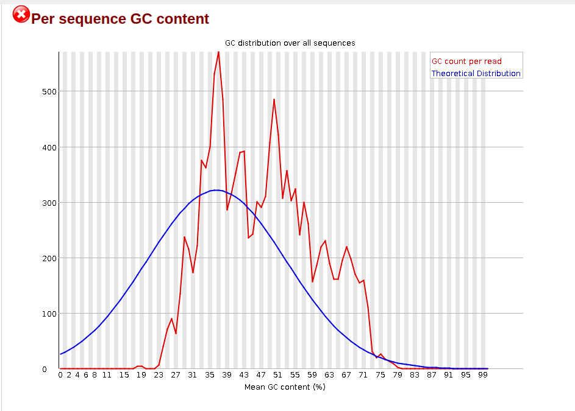
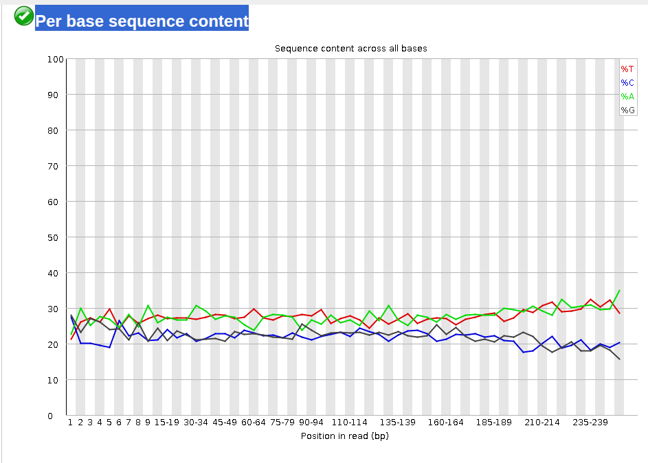

# Control de Calidad de Lecturas NGS – Muestra S6
## Bioinformática e investigación reproducible para análisis genómicos
## Tarea 1 Unidad 3
### Autor José de la Fuente, 21 de octubre de 2025

---

## 1️Usando comandos Unix:
Contar el número de lecturas (reads) en un archivo fastq:
 
```bash
zcat ../181004_curso_calidad_datos_NGS/fastq_raw/S6_R1.fastq.gz | awk '{n++} END{print n/4, "lecturas"}'
```
Con ello se obtuvieo que la cantidad de lecturas para dicho archivo fue:

* S6_R1.fastq.gz : 23,509 lecturas


Previsualizar las primeras 40 líneas del mismo archivo fastq:

```bash
zcat ../181004_curso_calidad_datos_NGS/fastq_raw/S6_R1.fastq.gz | head -n 40
```
Obteniendose la siguiente previsualización:

```bash
@M03564:2:000000000-D29D3:1:1101:15060:1406 1:N:0:ACAGTGGT+TGCTAAGT
GTGAGGGAGCTACTCTCTTTAAAATCAAAGTAACTAAATATAACGAATTAATTTTTTCTAAATATTTTGCTACTGCAAAAGAGTTAGCACTAATTACAAAAAAAACATGCTCATAACAAAAGAAGTAAATATTGTTAGGGAGAACTTACATCTAAATCTACTTTAACTGTTTTAAAGAAATCATGAAGTTAAATTACCTCATCTATATTACATTCATGTTCTTTACAGAGAACTTCAATAATTCTTGTATC
+
CBCCCFCCCCFFGGGGGGGGGGHHHHHHHHHHHHHHHHHHHHHHGGGHHHHHHHHHGHHHHHHHHHHHHHHHHHHHHHHHHGHHHHHHHHHHHHHHHHHHHHGGGGHHHHHHHHHHHHHHHGGHHHHHHHHHHHHHHHHHHGGHHHHHHHHHHHHHHGHHHHHHHHHHHHHHHHHHHHHHHHHHHGHHHHHHHHGHHHHHHHHHHHHHHHHGHHHHHHHHHHHHHHFFFFFHHHHHHHHHHHH0CFGFFGB
@M03564:2:000000000-D29D3:1:1101:17470:1442 1:N:0:ACAGTGGT+TGCTAAGT
GTTATCATAGGCATAGATACTGGGATCGGGAGAATACTCGGGGTTGTCAATTTCTGGGTGGATCCAAGTGCCCTTGTAATCTGGGTTGTCGATCTGCCGGGGCTTCCACTCACCCTGCAGAAGGGAGAAGGAAACCGAAGGGTGAGTAAGGTTGGTGCACTCCCCACTGTGAGCCCCAGCCCTGCTCAGAGCCCCAAACTCACCTTGTACTCAGGGTTCTGAATCACTGGGGGTTCCCACTCTCCGTCCAT
+
BCCCCFFFFFFFGGGGGGGGGGHHHHGGGGGGGHHHHHHGGGGGGGGHHHHHHHHHHHFFGHHHHHHHHHHHHHHHHHHHHHHHHHGGGHGHGHHHHHGGGGGGHHHHHHHHHHHHHHHHHHHHGHGGHHHHHHHHGGGGGGHGHHHHHHHHHHGGGHHHHHHHGHGHHHHHHHHGGGGGGGGGGGGGGGGGGGGGDGGGGGGGGGGGGGFFFFFFFFFFFFFFFFFFFFFFFFFFFFFFFFFFFFFFFF0
@M03564:2:000000000-D29D3:1:1101:16058:1443 1:N:0:ACAGTGGT+TGCTAAGT
TAATCCAGAGGTCTGCGGGCAGGAGCTATGAAAAGGACAGGGAGTGGTGTTTGCCCTCTGGGTGAGCAGTGAAGGCATGAGTCTCACACCCCCGGCTTCCGCTCCACAGCATGTCCAGCTGGGGGCCCAGGGCGCTGAATGATGGCCGGTCCTGTGGGCTAGGGGCCCAGCACAGCTTCATGAGCTCGTGAACCTGAGGGGCGGGGGACAGATAATGGGGTCGTGCCTGAGCGAATTTCGACGATCGTTGC
+
CCCCCFFFFCCFGGGGGGGGGGGGGHHHHHHHHHHGGHHGGGFGEGGHGHGHHHHHHHHHHHGGHHHHHHHHHHHHGHHHHHHHHHHHHGGGGGGGGGHHGGGGGHHHHHHHHHHHHHHHHHGGGGGGGHGGGGGGGGHHHHHHHHHGGGGGHHHGGGGGGGGGGGGGGGGGGGGGGGGFFFFFFFFFFFFFFFFFFFFFFFFFFFF-C?E9FFFFFFFF?DF=D9EFFFFFFA=>EFFFAFF;.;BBEF.
@M03564:2:000000000-D29D3:1:1101:14152:1444 1:N:0:ACAGTGGT+TGCTAAGT
ATGAAAATGGCTCTGCCGGAGCACTAGTCTGCTTCCTTGGTCTCTGATTTTTCTCTGCAGATTCCCCAGACTGAGTCAGGGAATGAGAAGGAAAAGTAAAAGTTGGGTTTAAGGCACTAGTGGCAAGAGGACTAACAGAAATGCTTAACGAGGAAGAGACAGAAGACGGGGGGGTGAGAGGTGAGAGCTCAGAACTACTAAGCCTTCCACTTCTTGTCCTCATGGAGTGAGGCGAATTTCGACGATCGTTG
+
CCCBCFFFFFFFGGGGGGGGGGHHHHHHHHHHHHHHHHHHHHHHHHHHHHHHHHHHHHHHHHHHHHHHGHGHHHHHHHHHHGGHHHHHHHHHHHGHHHHHHHHHHHGGGGHHHHHHHHGHHHHGHHGHHHHHHHHHHHHGHHHHHHHHHGGGGGHHHHHHHHHHHHHGGGGGFFFFFFFFFBFFFFFFFFFFFFFFFFFFFFFFFFFFFFFFEFFFFFFFFFFFFFFFFFFFFFBCFFFFFFFFFEFFFFB
@M03564:2:000000000-D29D3:1:1101:14990:1450 1:N:0:ACAGTGGT+TGCTAAGT
TAATCCAGAGGTCTGCGGGCAGGAGCTATGAAAAGGACAGGGAGTGGTGTTTGCCCTCTGGGTGAGCAGTGAAGGCATGAGTCTCACACCCCCGGCTTCCGCTCCACAGCATGTCCAGCTGGGGGCCCAGGGCGCTGAATGATGGCCGGTCCTGTGGGCTAGGGGCCCAGCACAGCTTCATGAGCTCGTGAACCTGAGGGGCGGGGGACAGATAATGGGGTCGTGCCTGAGCGAATTTCGACGATCGTTGC
+
DDCCDFFFFDDFGGGGGGGGGGGGGHHHHHHHHHHGHHHGGGGGEHGGGHGHHHHHHHHHHHHGHHHHHHHHHHHHHHHHHHHHHHHHHGGGGGGGGGHHGGGGGHHHHHHHHHHHHHHHHHGGGGGGGHGGGGGGGGHHHHHHHHHGGGGGHHHGGGGGGGGGGGGGGGGGGGGGGGGFFFHFFFFFFFFFFFFFFFFFFFFFFFF-DEF/FFFFFFFFADF=DAFFFEFEAAFFFFEFFF--;E>F./.
@M03564:2:000000000-D29D3:1:1101:14282:1451 1:N:0:ACAGTGGT+TGCTAAGT
CTTTAGCAAAGAGCTTGGCGCAATCATGACACAGTGAGAAATCATGAGACCACTGTGCATCCCACCCTTTGCCTGGAGTTGTGGATCCACAGCTCTTACAGCGAACACACTTGGTACAGATCTAGAAAAGAAGAAAAGAAATTCAATAGGAATTTCTTGTTTTTAATATCTTTACTTAACTAAAAAGATCTTAAATGCATCCATTTATAGATTTAATTTCTCTGCTGAGATGATTTCCTAGTAATGAGGCA
+
DEEEDFFFFFFFGGGGGGGGGGGGHHHHHHHHHHHHHHHHHHHHHHHHHHGHHHHHHHHHHHHHHGGHHHHHHHHHHHHHHHGGHGHHHHHHHHHHHHHHHHGGGGGHHGHHHHHHHHHHHHHHHHHHHHGHHHHHHHGHHHHHHHHHHHHHHHHHHHHHHHHGHHHHHHHHHHHHHHHHHHHHHHGGHHHHHHGHHHHHHHHHHHGHHHHHHHHHHHHGHHHHGHHHGHFHHFHHGGGGGGGGGGFGGGG
@M03564:2:000000000-D29D3:1:1101:16192:1473 1:N:0:ACAGTGGT+TGCTAAGT
TGAAGAAAACAAGCTAGCAGAACATTTTGTTTCCTCACTAAGGTGATGTTCCTGAGATGCCTTTGCCAATATTACCTGGTTACTGCAGTCATTTAAGCTATTCTTCAATGATAATAAATTCTCCTCTGTGTTCTTAGACAGACACTCGGTAGCAACGGTGCTATGCCTAGTAGACTGAGAAGGTATATTGTTTACTTTACCAAATAACAAGTGTTGGAAGCAGGGGCGAATTTCGACGATCGTTGCATTAA
+
CCCCCFFFFFCCGGGGGGGGGGHHHHHHHHHHHHHGHHHHHHGFGHHHHHHHHHHHHHHHHIGHHHHGHHHHHHHHHHHHHHHHHHHHHHHHHHHHHHHHHHHHHHHHHHHHHHHHHHHHFHHHHHHHHHHHHHHHHHHGHHHHHHHGGGHGHHHHGGEGGHHHHHHHHHGHHEHHHHHHHHGFGHHHHHHHHHHHHHHHHHHHHGHHHHHHGGHHHGHHGHHGGGGGEGGGGGGGGGFGGCGGGGGGGFF
@M03564:2:000000000-D29D3:1:1101:16921:1478 1:N:0:ACAGTGGT+TGCTAAGT
ATGCTGAGGGCTGGAGGAGGAAGCAAGCATACCCAAGGTGAAGATCTCCCAGAGCAGGATCCCGAAGGACCACACGTCGCTCAGGGTGGTGTAGAGGCTGTTGAAGATGCTCTCCGGAGCCATCCACTTTAAAGGCAAAAAGGTCTGTAGGGAGGTCAGGACAGGTGCTGAGTGCAAGGAAGGACCTCAGCCCCACTCTGCACCTGGGATGGGAGGAGGGTATCTGCGAATTTCGACGATCGTTGCATTAA
+
CCBCCFFFCCCFGGGGGGGGGGHHHHHHHHHHHHHHHGHHHHHHHHHHHHHHHHHHHHGHHHHGGGGGHHHHHHGGHHGGGHGHHHGGGGGHHHHHHGHHHHHHHHHHHHHHHHHGGGGGGHHHHGHGHHHHHHHHHHHHHGGGHHHHHGHGEDGDHHHHCGHGGGGHHHHGHHHGHHGHHGGHFHHHGHGGGGGGGGGGGEFGFGGGFGGGGBGFFFFCAFFFFFFFFFCEFFFFFFFFFFFFFAFFEFF
@M03564:2:000000000-D29D3:1:1101:16994:1484 1:N:0:ACAGTGGT+TGCTAAGT
TCAGACTATCAAAAGCATATCAAAACAAGTATATTAGACATGCAAATGATTATTTGTGATAAATGGATAATGTGATACATTTTTTGACTAACCTGGCTTATATAGTATTTTTTTTTCTCTTCCATCAAAATGAGTTTTAGAACTTTGCCCTGATGTTGACATTTTTCATTTCGTAGGAGGGAACAAAGGAGTTTGCTGCTGCTCTCACCGCTGAGCGGATAAAGACCCCACCAAAACGTCCAGGAGCGAAT
+
CCCCCFFFFFFFGGGGGGGGGGHHHHHHHGHHHHHHHHHHHHHHHHHHHHHHHHHHHHIIHIIHHHIHIHHHHHHHHHHHHHHHGGGHHHHHHHHHHHHHHHHHHHHHHHHHGGGGHHHHHHHHHHHHHHHHHHHHHHHHHHHHHHHHGHHHHHHHHHHHHHHHHHHHHHHHFHHGGHHGGGHGHHHHFHHHHHGFHGHHGHHHHHHHHEGGCGEHGGGGGGGGGGGGGGGGGGGGGGFEGFFFFEFFFF@
@M03564:2:000000000-D29D3:1:1101:17035:1487 1:N:0:ACAGTGGT+TGCTAAGT
GATTTCCACCTCCAAGGTGTATGAAGTATGTATTTTTTTAATGACAATTCAGTTTTTGAGTACCTTGTTATTTTTGTATATTTTCAGCTGCTTGTGAATTTTCTGAGACGGATGTAACAAATACTGAACATCATCAACCCAGTAATAATGATTTGAACACCACTGAGAAGCGTGCAGCTGAGAGGCATCCAGAAAAGTATCAGGGTAGTTCTGTTTCAAACTTGCATGTGGAGGCGAATTTCGACGATCGT
+
CBCCCFFFFFFFGGGGGGGGGGHHHHGHHHHHHHHHHGGHHHHHHHHHHHHHHHHHGGGGHHHHHHHHHHHHHHHGHHHHHHHHHHHHHHHHHHHHHHHHHHHHHHHHHGGGGGHHHHHHHHHHHHHHHHHHHHHHHHHGGHHHHHHHHHHHHHHHGHHHGHHHHHHHHHHGGGGHHHHHHHHHGGGHHHGHHHHHH<GHHHHHHFGGGGHHHGHHHHHHHHHHHGHHHHHGHGGGGGGGGGGGGGGGEGF
```


Ubicar la lectura 3 e identificar la información disponible. Describir en detalle la información entregada. ¿Donde se entrega la calidad del read?, ¿Cuál es el ID (identificador) del read? Etc. Utilice fechas y etiquetas para identificar cada parte.

Para ubicar la lectura 3, se analizara el archivo entre las lineas 9 y 12, ya que 4 lineas corresponden a una lectura

```bash
zcat ../181004_curso_calidad_datos_NGS/fastq_raw/S6_R1.fastq.gz | sed -n '9,12p'
```
Dando como salida lo siguiente:
```bash
@M03564:2:000000000-D29D3:1:1101:16058:1443 1:N:0:ACAGTGGT+TGCTAAGT #<-- Identificador del read
TAATCCAGAGGTCTGCGGGCAGGAGCTATGAAAAGGACAGGGAGTGGTGTTTGCCCTCTGGGTGAGCAGTGAAGGCATGAGTCTCACACCCCCGGCTTCCGCTCCACAGCATGTCCAGCTGGGGGCCCAGGGCGCTGAATGATGGCCGGTCCTGTGGGCTAGGGGCCCAGCACAGCTTCATGAGCTCGTGAACCTGAGGGGCGGGGGACAGATAATGGGGTCGTGCCTGAGCGAATTTCGACGATCGTTGC #<--secuencia de nucleótidos
+ #<--separador
CCCCCFFFFCCFGGGGGGGGGGGGGHHHHHHHHHHGGHHGGGFGEGGHGHGHHHHHHHHHHHGGHHHHHHHHHHHHGHHHHHHHHHHHHGGGGGGGGGHHGGGGGHHHHHHHHHHHHHHHHHGGGGGGGHGGGGGGGGHHHHHHHHHGGGGGHHHGGGGGGGGGGGGGGGGGGGGGGGGFFFFFFFFFFFFFFFFFFFFFFFFFFFF-C?E9FFFFFFFF?DF=D9EFFFFFFA=>EFFFAFF;.;BBEF. #<--calidad del read
```
Luego, de lo anterior podemos identificar que:

* ¿Donde se entrega la calidad del read?: Este se encuentra en la cuarta línea de la lectura.
* ¿Cuál es el ID (identificador) del read? : corresponde a la primera línea la cual es @M03564:2:000000000-D29D3:1:1101:16058:1443 1:N:0:ACAGTGGT+TGCTAAGT
* La linea de secuencia de nucleótidos está en la segunda linea
* El símbolo + indica separador entre la secuencia y la calidad del read.


Traducir el código de calidad para las primeras 10 bases del tercer read a valores numéricos (Q) usando la codificación entregada en clase.

La calidad de las primeras 10 pares de bases del tercer read son:
```bash
CCCCCFFFFC
```
Con lo cual, al calcular el valor Q para cada una de esas bases es:
```bash
34 34 34 34 34 37 37 37 37 34
```
Del resultado anterior, usando la relaciṕn
 > Q=-10xlog(p)

 Se obtiene que la probabilidad de error que una de esas 10 primeras bases este mal llamada esta entre aproximadamente 0.00040% y 0.00020%, lo que indica una alta confianza en la secuenciación.


## 2️ Genere un informe de calidad con FastQC para una muestra (cada estudiante una muestra distinta), para R1 y R2.

```bash
fastqc ../181004_curso_calidad_datos_NGS/fastq_raw/S6_R1.fastq.gz -o .
fastqc ../181004_curso_calidad_datos_NGS/fastq_raw/S6_R2.fastq.gz -o .
```
## 3️Baje los archivos HTML a su computador mediante sftp (puede usar cualquier cliente o la línea de comandos. 

```bash
scp bioinfo1@genoma.med.uchile.cl:jdelafuente/S6_R1_fastqc* .
scp bioinfo1@genoma.med.uchile.cl:jdelafuente/S6_R2_fastqc* .
scp bioinfo1@genoma.med.uchile.cl:jdelafuente/S6_R1_filter_fastqc* .
scp bioinfo1@genoma.med.uchile.cl:jdelafuente/S6_R2_filter_fastqc* .
```
---

## 4️Analice el informe de calidad creado con fastqc para las lecturas R1 y R2.

El analisis se hará con respecto a las recturas R1 y R2 sin filtrar.




Como se puede observar, ambas secuencias poseen el mismo numero de lecturas, largo y proporcion de GC. 

### Para R1: 

### Para R2:


De las imagenes anteriores se puede obvservar que en R1 La calidad es muy alta y estable en todo el rango de 1 a 250 bases, con valores de Q > 30.
Esto indica que más del 99.9 % de las bases tienen probabilidad de error menor a 0.001.
Para el caso de R2 Se observa una disminución progresiva de la calidad hacia el extremo 3’, con una caída de Q ≈ 36 a Q ≈ 28–30 en las últimas 30 bases. De lo anterior se puede inferir que es necesario un proceso de triming en dicha zona, para mejorar la calidad.
En cuanto a la distribución de calidad de la lectura se tiene
### Para R1:


La calidad global de ambas lecturas es alta y consistente. Sin embargo, la variabilidad ligeramente mayor en R2 confirma lo observado en la calidad por base

Al analizar el contenido GC en cada secuencia, se tiene que:

### Para R1:

### Para R2:


R1 y R2 muestran una distribución unimodal y simétrica, centrada alrededor del 43–44 % GC.

No se observan picos secundarios ni desplazamientos significativos, lo que descarta contaminación con ADN de distinta composición.

Finalmente, al analizar el contenido por base en la secuencia, se tiene:

### Para R1


### Para R2


De estas imagenes, se puede notar que R1 muestra una composición estable y típico de una secuenciación de buena calidad. En cambio, para R2 se observa una disparidad en el contenido de las bases, lo cual apoya la decisión de realizar triming en esos pares de bases finales.

---

## 5️ Compare los valores calculados en el punto 1 con lo entregado en el informe de calidad obtenido con FastQC
Como se puede observar en la imagen, las 10 primeras bases se encuentran entre los valores de 34 y 37, lo que se condice con lo obtenido desde el archivo fastq original.


---

## 6️ Seleccione las 4 figuras más importantes a su criterio para analizar la calidad de la corrida, cópielas a un archivo Markdown en su repositorio y agregue su interpretación de cada figura. Recuerde hacer la comparación de R1 y R2 para las secuencias crudas y las secuencias podadas.

Las cuatro figuras que escogeré son: Per base sequence quality, Per sequence quality scores, Per sequence GC content y Per base sequence content.

### Para R1 raw:


### Para R2 raw:
![Valores Q desde reporte por FastQC]images/(S6_R2.png)


### Para R1 filtred:




### Para R2 filtred:






Para el caso de Per base sequence quality, se puede notar que R1 no mostró problemas mayores, pero el filtrado suavizó pequeñas variaciones. R2 mejoró notablemente tras el trimming, eliminando la degradación del extremo 3’. El trimming fue efectivo y selectivo, conservando las regiones informativas.

En cuanto a Per sequence quality scores, se observa que el filtrado eliminó lecturas con calidades promedio bajas (especialmente en R2). El resultado es un conjunto más confiable para alineamientos y ensamblajes, con menor varianza de calidad entre lecturas.

Al analizar el gráfico de Per sequence GC content, se ve que la eliminación de lecturas de baja calidad también redujo la varianza en el contenido GC, estabilizando la composición global. Esto sugiere que el trimming removió adaptadores y fragmentos cortos con GC anómalos.

Finalmente al comparar los gráficos de Per base sequence content, se muestra que el trimming mejoró la uniformidad de la composición de bases, especialmente en los primeros ciclos donde suelen aparecer errores ópticos o adaptadores. R1 quedó completamente equilibrado tras el filtrado. R2 mejoró sustancialmente, aunque retiene pequeñas diferencias esperables por su naturaleza reversa.

---


