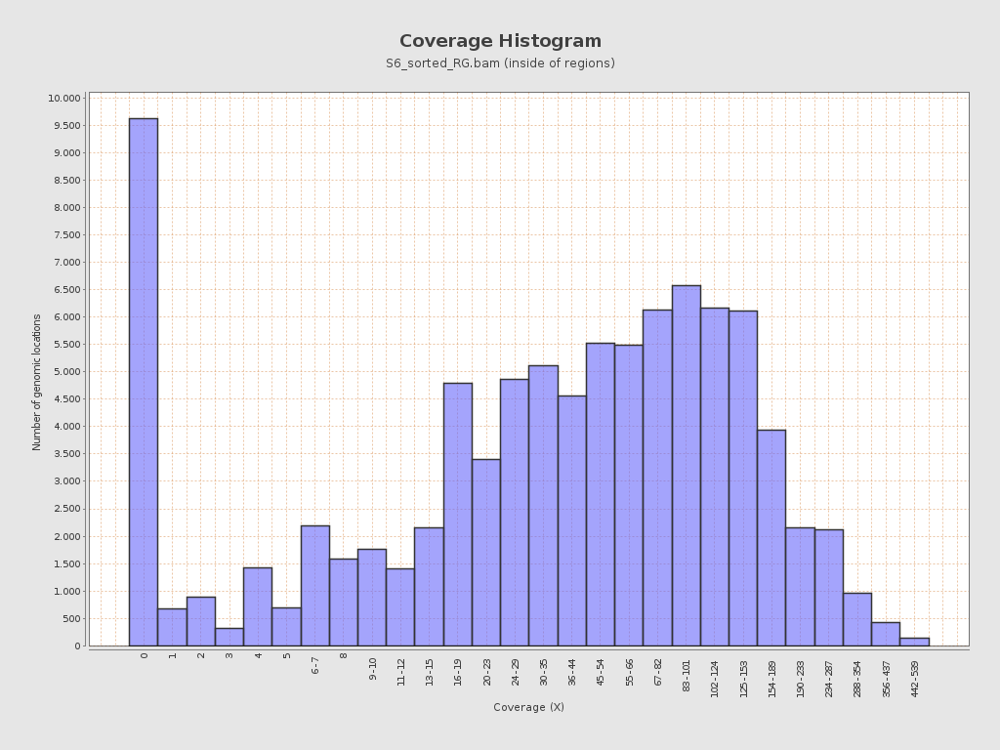
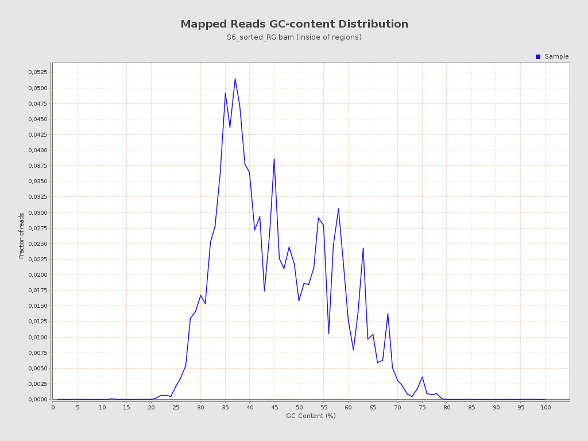
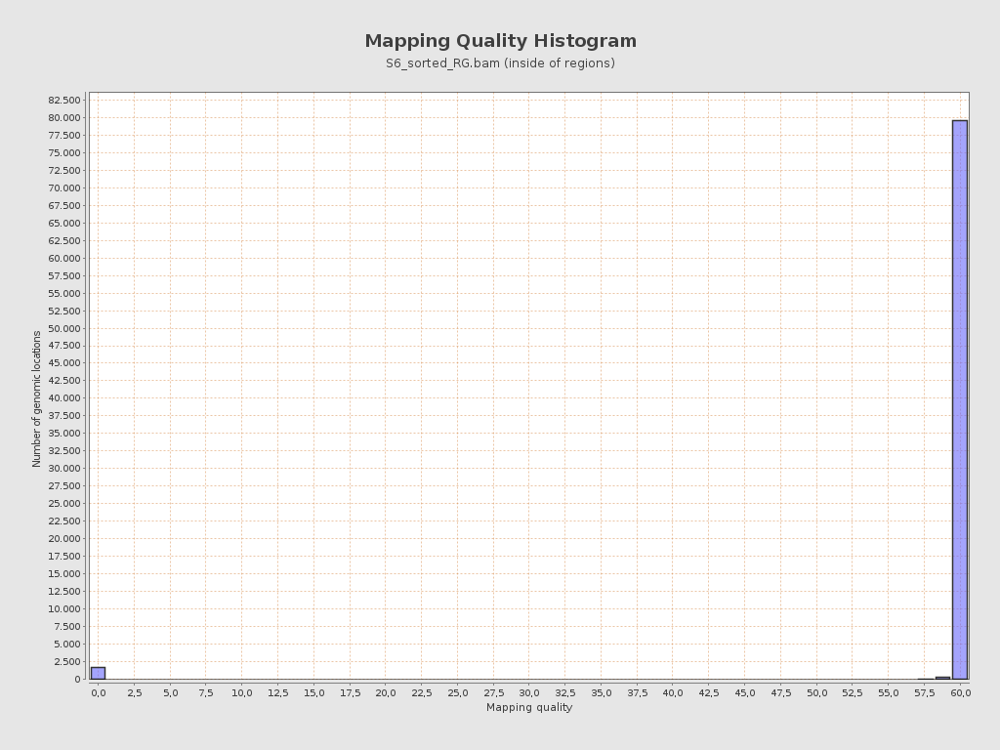
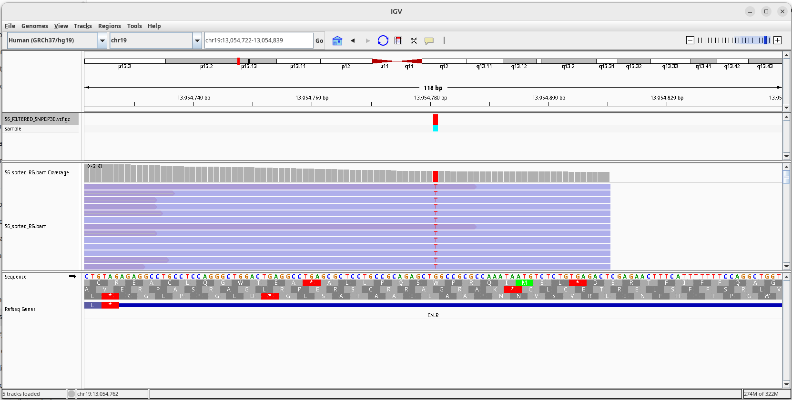

# Tarea 3, Unidad 3
## José de la Fuente R.
### Filtro y alineamiento de lecturas

1. Realizar el alineamiento contra el genoma humano hg19 de las lecturas R1 y R2 del paciente seleccionado para la tarea de control de calidad de lecturas de secuencia.

```
bwa mem -t 4 -M /datos/reference/genomes/hg19_reference/hg19.fasta \
S6_R1_filter3.fastq.gz \
S6_R2_filter3.fastq.gz \w
> S6.
```

2. Utilizando una línea de comando, encuentre la primera lectura en el archivo SAM que contenga bases enmascaradas (secuencias suavizadas por soft-clipping).

``` 
awk 'BEGIN{FS=OFS="\t"} $1!~/^@/ && $6~/[0-9]+S/ {print $1,$6; exit}' S6.sam
M03564:2:000000000-D29D3:1:1101:15679:2529	237M14S
```

1. Muestre el registros de la lecturas en el archivo SAM e identifique y explique el código CIGAR de esa lectura.
```
awk 'BEGIN{FS="\t"} $1 ~ /^@/ {next} $6 ~ /[0-9]+S/ {print; exit}' S6.sam
M03564:2:000000000-D29D3:1:1101:15679:2529	99	chr11	119169032	60	237M14S	=	119169169	237	CGTCAGAAGAAGATAACATCACTCATTTTTCTCCAGGTGAAGGGAATTTGGCCGCAGCCCATGCCAACACTGGTCCCGAGGAGTCAGAAAATGAGGATGATGGGTATGATGTCCCAAAGCCACCTGTGCCGGCCGTGCTGGCCCGCCGAACTCTCTCAGATATCTCTAATGCCAGCTCCTCCTTTGGCTGGTTGTCTCTGGATGGTGATCCTACAACAAGTGAGTCTCCAGACTACTGCGAATTTCGACGA	BBACCCFFFFFFGGGGGGGGGGHHHHHHHHGHHHHHHGGHHHHGHHHHHHHHHGGGGGHGHHHHHHHGGGHHHHHHHGGGGGGHHHHHHHHHHHHHHHHHHHHHHHHHHHHHHHHHHHHHHHHHHGGHHHGGGGGGGGGHHGHHGGGGGGGHHHHHHHHGHHHHHHHHHHHHHHHGHHHGHHHGHHGHGGGFGGFGGGGGGGGGGBFFGFGGGGGGGGGGGFFFFFFFFFFFFFFFFFFFFFFFFFEFFF9	NM:i:0	MD:Z:237	MC:Z:100M	AS:i:237	XS:i:19
```

El código CIGAR de esta lectura es 237M14S, lo cual se desglosa de la siguiente manera:
* 237M nos indica que se alinearon 237 bases con la secuencia de referencia, sin distinguir entre match/mismatch.
* 14S nos indica que las 14 bases al final del fragmento fueron suavizadas por soft-clipping. Lo anterior puede ser resultado de por ejemplo la baja calidad de la lectura en dichas bases. 

1. Generar un reporte técnico de calidad del alineamiento con qualimap.

```
qualimap bamqc -bam S6_sorted_RG.bam -gff ~/181004_curso_calidad_datos_NGS/regiones_blanco.bed -outdir ./S6_sorted_RG
```
## Resultados

Desde el informe generado por Qualimap, se escogieron las figuras Coverage Histogram, Mapped Reads GC-content Distribution, Mapping Quality Histogram y Duplicate Rate Histogram.


<figure style="background-color: #ffffff; color: #000000; text-align: left; width: 80%; border: 1px solid #ddd; padding: 10px;">
  
  <figcaption style="font-size: 14px; text-align: justify;">
    <b>Figura 1.</b> Distribución de la profundidad de cobertura (Coverage, X) en las regiones analizadas. El eje X representa el número de lecturas que cubren cada posición genómica, y el eje Y el número de ubicaciones genómicas con dicha cobertura.
  </figcaption>
</figure>  


<figure style="background-color: #ffffff; color: #000000; text-align: left; width: 80%; border: 1px solid #ddd; padding: 10px;">
  
  <figcaption style="font-size: 14px; text-align: justify;">
    <b>Figura 2.</b> Distribución del contenido GC (%) de las lecturas mapeadas. El eje X indica el porcentaje de GC en las lecturas, y el eje Y la fracción relativa de lecturas con dicho contenido.
  </figcaption>
</figure>


<figure style="background-color: #ffffff; color: #000000; text-align: left; width: 80%; border: 1px solid #ddd; padding: 10px;">
  
  <figcaption style="font-size: 14px; text-align: justify;">
    <b>Figura 3.</b> Distribución de la calidad de mapeo (MAPQ) de las lecturas. El eje X representa los valores de calidad de alineamiento y el eje Y el número de posiciones genómicas con dichos valores.
  </figcaption>
</figure>  


<figure style="background-color: #ffffff; color: #000000; text-align: left; width: 80%; border: 1px solid #ddd; padding: 10px;">
  
  <figcaption style="font-size: 14px; text-align: justify;">
    <b>Figura 4.</b> Distribución de la tasa de duplicación de lecturas. El eje X representa el número de duplicaciones y el eje Y el número de lecturas afectadas.
  </figcaption>
</figure>  


La Figura 1 muestra una distribución asimétrica, con un máximo principal entre 60× y 100× en las coverturas, el cual coincide con el promedio reportado en el informe, que es de 67,36. Además se observa otro máximo en 0x, lo cual permite interpretar que si bien la mayoría de las regiones e encuentran cubiertas y con buena profundidad, existe un conjunto de posiciones sin lecturas mapeadas, lo cual puede ser indicador de regiones con alta cantidad G/C o repetitivas. 

En cuanto a la figura 2,  se observa un máximo del contenido G/C en las cercanías del 35%, disminuyendo hacia valores de 70% de GC. Además no se observan otros máximos dentro del histograma. Si bien el genoma humano suele rondar entre 40 y 41%, lo el porcentaje obtenido se puede explicar debido, por ejemplo, a que las zonas ricas en GC tienden a amplificarse peor en PCR, debido a la termoestabilidad de los enlaces GC, o como también consecuencia del trimming con altas lecturas GC. De todas formas, la grafica solo muestra una distribución unimodal, por lo que se puede afirmar que no hubo contaminación.

En la Figura 3 se puede observar un máximo único  MAPQ ≈ 60, lo que representa una alta confianza en el alineamiento obtenido. Además permite afirmar que la mayoría de las secuencias se alinearon de manera única, lo que sugiere que el proceso fue exitoso.cual refleja una altísima confianza en el alineamiento. El máximo observado en 0 en la Figura 1, podría vincularse a regiones repetitivas o zonas del genoma sin representatividad en el set de la lectura, más que errores de mapeo.
No obstante, el pico en cobertura cero (Figura 1) podría estar asociado a regiones repetitivas o segmentos del genoma sin representación en el set de lectura, más que a errores de mapeo.

Finalmente, en la Figura 4 muestra una alta tasa de duplicación de lecturas, tasas de duplicación bajas (1–3×), lo cual es indicador de que las lecturas son únicas o casi únicas. Pero a su vez, se puede notar que existe una cola hacia la derecha lo cual muestra que de todas formas existen varias lecturas con múltiples copias. El resumen entregado por Qualimap, indica que la tasa de duplicación fue de 37.47%, dando a entender que más de un tercio de las lecturas son copias de otras ya existentes. Lo anterior se podría explicar por sobreamplificación por PCR, o baja complejidad del DNA de partida, lo que se traduce en menos información a extraer desde las lecturas.


---
## Conclusiones

En cuanto a la cobertura, el promedio de 67,36x nos indica que hay una buena posibilidad para el análisis de variantes, pero que a su vez hay muchas lecturas sin mapear, lo que muestra heterogeneidad en la representación genómica. Esto podría ser indicador de que existen zonas dificiles de amplificar o de alinear. El contenido de GC, muestra un máximo ubicado hacia el 35%, lo que puede ser indicador de problemas con la amplificación por PCR y pérdida de zonas con alto contenido GC. De todas formas. la calidad obtenida del mapeo, muestra que la mayoría de las lecturas se alinearon de forma única, lo cual habla de que el alineamiento es fiable, pero con una alta tasa de duplicación, lo cual podría reforzar la idea de que existieron problemas al momento de amplificar con PCR.

---

## Anexo

Reporte generado por Qualimap.

[Ver reporte completo de Qualimap](https://josedelafuenter22.github.io/Tareas_BioninfoRepro2025_jfdr/Unidad3/Tarea3/qualimapReport.html)

---

### Llamado de variantes

## Materiales y métodos

| N° | Gen    | Cromosoma | Inicio    | Fin       |
| -- | ------ | --------- | --------- | --------- |
| 1  | ABL1   | chr9      | 133589701 | 133761072 |
| 2  | BRAF   | chr7      | 140434394 | 140624508 |
| 3  | BRCA1  | chr17     | 41197692  | 41267801  |
| 4  | BRCA2  | chr13     | 32890592  | 32972909  |
| 5  | CALR   | chr19     | 13049488  | 13054729  |
| 6  | CBL    | chr11     | 119077122 | 119170493 |
| 7  | CEBPA  | chr19     | 33792241  | 33793325  |
| 8  | CRLF2  | chrX      | 1314884   | 1331532   |
| 9  | EZH2   | chr7      | 148504735 | 148544395 |
| 10 | FLT3   | chr13     | 28578186  | 28674652  |
| 11 | IKZF1  | chr7      | 50358652  | 50468327  |
| 12 | IL7    | chr8      | 79645945  | 79717162  |
| 13 | JAK2   | chr9      | 5021982   | 5126793   |
| 14 | JAK3   | chr19     | 17937549  | 17955231  |
| 15 | KIT    | chr4      | 55524176  | 55604725  |
| 16 | KRAS   | chr12     | 25362726  | 25398323  |
| 17 | MLL    | chr11     | 118307222 | 118392889 |
| 18 | MPL    | chr1      | 43803514  | 43818445  |
| 19 | P2RY8  | chrX      | 1584369   | 1585456   |
| 20 | PAX5   | chr9      | 36840554  | 37034033  |
| 21 | PDGFRA | chr4      | 55124930  | 55161441  |
| 22 | PDGFRB | chr5      | 149495323 | 149516615 |
| 23 | PTEN   | chr10     | 89624221  | 89725231  |
| 24 | RB1    | chr13     | 48878043  | 49054209  |
| 25 | SF3B1  | chr2      | 198257024 | 198299728 |
| 26 | TP53   | chr17     | 7572924   | 7579917   |
| 27 | WT1    | chr11     | 32410601  | 32456896  |


El panel abarca 27 genes relacionados con cánceres hematológicos y de predisposición genética, incluyendo TP53, BRCA1/2, KRAS, JAK2/3, FLT3, PDGFRA/B, entre otros.
Según el reporte de Qualimap, las regiones blanco del panel cubren un total de 91.120 pares de bases (bp) dentro del genoma humano de referencia lo cual corresponde a un porcentaje cercano al 0%. 


Realice el filtrado de variantes con dos filtros, DP<10 y uno adicional que usted proponga.

**Para DP <10**
```
java -jar /opt/GenomeAnalysisTK-3.7-0/GenomeAnalysisTK.jar -T VariantFiltration -R /datos/reference/genomes/hg19_reference/hg19.fasta -V S6_RAW_SNP.vcf --filterExpression "DP <10" --filterName "FILTER" -o S6_FILTERED_SNPDP10.vcf
```
**Para DP &le;30**
```
java -jar /opt/GenomeAnalysisTK-3.7-0/GenomeAnalysisTK.jar \
-T VariantFiltration \
-R /datos/reference/genomes/hg19_reference/hg19.fasta \
-V S6_RAW_SNP.vcf \
--filterExpression "DP <= 30" \
--filterName "LowDP" \
-o S6_FILTERED_SNPDP30.vcf
```


Estime cuántas variantes son eliminadas por el filtro DP<10 solamente, y cuántas por ambos filtros.

**Previo al filtro** 
```
bcftools view -H S6_FILTER_VARIANTS.vcf | wc -l
8
```
**Filtro DP<10**
```
bcftools view -H S6_FILTERED_SNPDP10.vcf | wc -l
7
```
**Filtro DP<=30**
```
bcftools view -H S6_FILTERED_SNPDP30.vcf | wc -l
7
```
# Total de variantes 
```bcftools view -H S6_FILTER_VARIANTS.vcf | wc -l 
8
```
# Número de SNPs 
```
bcftools view -v snps S6_FILTER_VARIANTS.vcf | wc -l 
```
# Número de INDELs 
```
bcftools view -v indels S6_FILTER_VARIANTS.vcf | wc -l 
```

Las salidas respectivas fueron: 8 70 64 
# Filtro DP<10 
```
bcftools view -v snps S6_FILTERED_SNPDP10.vcf | wc -l bcftools view -v indels S6_FILTERED_SNPDP10.vcf | wc -l 
```
# Filtro DP&le;30 
```
bcftools view -v snps S6_FILTERED_SNPDP30.vcf | wc -l bcftools view -v indels S6_FILTERED_SNPDP30.vcf | wc -l 
```
Las salidas para los códigos anteriores fueron: 68 61 68 61

Con ello se pudo generar la siguiente tabla:

| Tipo de variante | Original | Pasan DP < 10 | Pasan DP &le; 30 |
| ---------------: | :------: | :---------: | :---------: |
|         **SNPs** |    70    |      68     |      68     |
|       **INDELs** |    64    |      61     |      61     |
|      **Totales** |  **134** |   **129**   |   **129**   |

Visualice una variante en IGV, mostrando tracks tanto para el alineamiento (bam) como las variantes detectadas (VCF).

Asegúrese de usar un tamaño de ventana que muestre suficiente detalle como para leer la secuencia de referencia, pero sin un zoom excesivo para que se logre ver algo de contexto de secuencia. Ojalá que se vean otras variantes al rededor de la central. Incluya un track con los genes. Si no se ve ningún gen cercano a la variante, elija otra variante.

En resultados, indique en formato de tabla el número de variantes detectadas según ubicación (intrónica, río arriba, río abajo, codificante con cambio de sentido, sin sentido, etc).

Para deterctar las variantes, se usó la siguiente linea de comando:
```
bcftools query -f '%CHROM\t%POS\t%ID\t%REF\t%ALT\n' S6_FILTERED_SNPDP30.vcf.gz
chr19	13054781	rs1049481	G	T
chr19	17941143	rs2302600	A	C
chr19	17941173	rs2302601	C	G
chr19	17941294	rs2302603	T	C
chr19	17942370	rs1122385	T	C
chr19	17946054	rs2072496	G	A
chr19	17952609	rs3212730	T	G
```
Con ello se pudieron identificar las zonas del cromosoma 19 para hacer la visualización de dichas zonas e identificar el tipo de modificación en las variantes. 

<figure style="background-color: #ffffff; color: #000000; text-align: left; width: 80%; border: 1px solid #ddd; padding: 10px;">
  
  <figcaption style="font-size: 14px; text-align: justify;">
    <b>Figura 5.Variante en zona exóxina del gen CALR</b> .
  </figcaption>
</figure>

Con lo anterior, se puede generar la siguiente tabla:


| Gen  | Cromosoma | Posición  | Tipo | Cambio | Ubicación                        | Efecto (putativo, por IGV)                  | dbSNP     |
|------|-----------|-----------|------|--------|----------------------------------|---------------------------------------------|-----------|
| CALR | chr19     | 13054781  | SNP  | G→T    | Exónica (codificante)            | Probable missense  | rs1049481 |
| JAK3 | chr19     | 17941143  | SNP  | A→C    | Exónica (codificante)            | Missense                                     | rs2302600 |
| JAK3 | chr19     | 17941173  | SNP  | C→G    | Exónica (codificante)            | Missense                                     | rs2302601 |
| JAK3 | chr19     | 17941294  | SNP  | T→C    | Exónica (codificante)            | Missense                                     | rs2302603 |
| JAK3 | chr19     | 17942370  | SNP  | T→C    | Exónica (codificante)            | Sinónimo (no cambio AA visible)              | rs1122385 |
| JAK3 | chr19     | 17946054  | SNP  | G→A    | Exónica (codificante)            | Missense                                     | rs2072496 |
| JAK3 | chr19     | 17952609  | SNP  | T→G    | Splicing (límite exón–intrón)    | Posible afectación de sitio de splicing      | rs3212730 |


Las variantes poseen una profundidad por sobre 120, por lo se puede suponer que existe una buena cantidad de lecturas, lo que permite confiar en los resultados obtenidos.

## Conclusiones

Con el siguiente código en R, se analizó el archivo entregado por la plataforma VEP

```r
> # cargamos el archivo txt obtenido desde la plataforma VEP
> vep <- read.delim("VEP.txt", header = TRUE, sep = "\t", quote = "", comment.char = "", check.names = FALSE)
> # Mantener variantes con CADD_PHRED > 20 o CLIN_SIG distinto de "benign"
> vep_filtrado <- subset(
+   vep,
+   (is.na(CADD_PHRED) == FALSE & CADD_PHRED > 20) |
+     (is.na(CLIN_SIG) == FALSE & tolower(trimws(CLIN_SIG)) != "benign")
+ )
> # chequeo de cuantas variantes pasan el filtro.
> nrow(vep_filtrado)
[1] 0
```
Al analizar las anotaciones de las varianes con VEP, se obtienen 46 observaciones de las cuales ninguna posee un valor distinto a bening, ni tampoco con un valor CAAD > 20. Lo anterior indica que no hay evidencia de que estas anotaciones sean patogénicas. 
Las variantes en JAK3 (rs2302600, rs2302601, rs2302603, rs2072496, rs1122385 y rs3212730) se encuentran en zonas exónicas y presentan en general cambios de sentido (missense), con excepción de una sinónima (rs1122385) y una en el límite exón–intrón (rs3212730), pudiendo tener un posbile impacto en el splicing del transcrito. Por otro lado, la variante del gen CALR (rs1049481) se ubica en una región exónica con cambio de base G→T, lo que podría suponer un posible efecto missense. Lo anterior, podría sugerir que las variaciones detectadas pueden ser polimorfismos normales en la población en el cromosoma 19, ya que no se detectaron fenotipos patológicos. 
