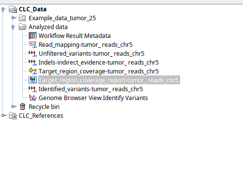
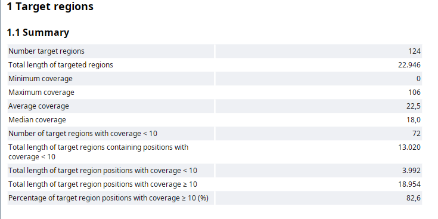
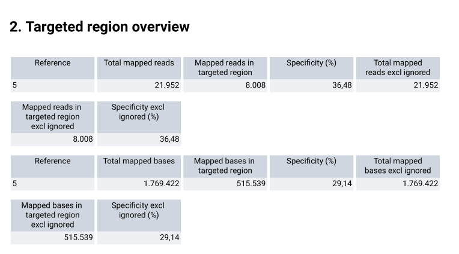
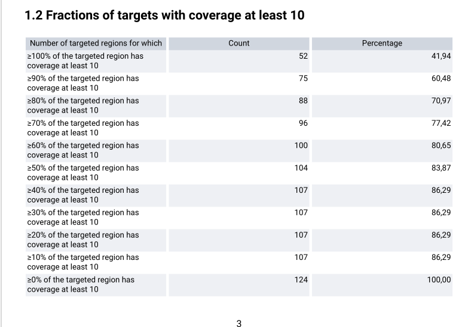
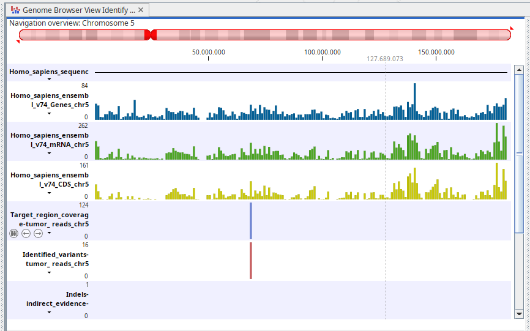
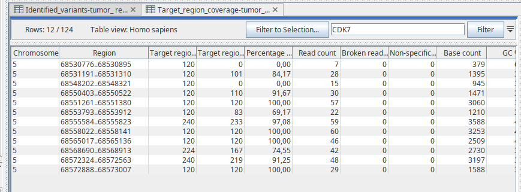
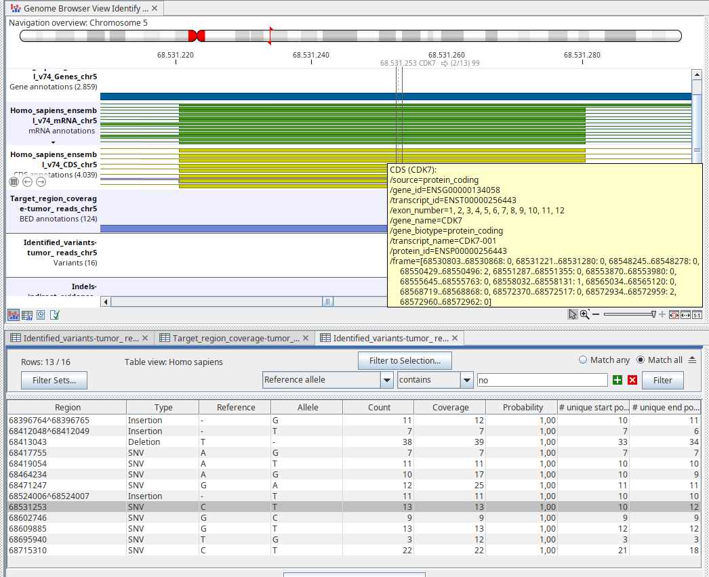
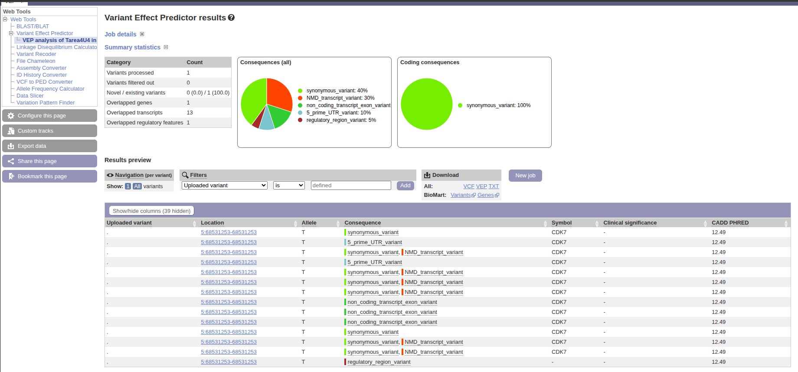
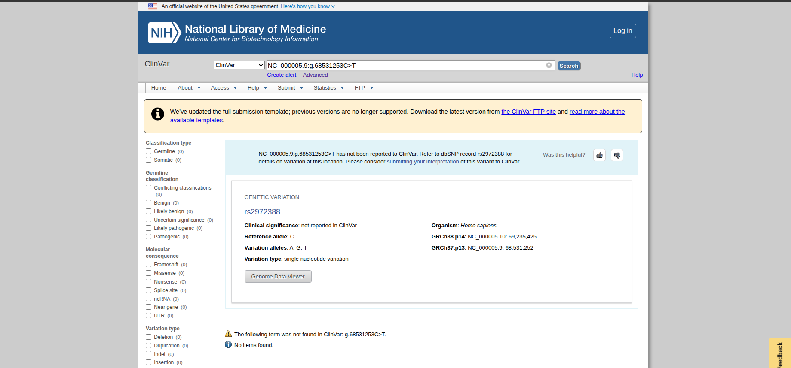

# Identificación de variantes en una muestra de tumor
## José de la Fuente R.

Para el desarrollo de esta actividad, se usarán datos de una muestra de carcinoma acínico masivo, cuya secuencia fue obtenida a través de la plataforma Illumina 2000 y reportada en 2013 por A.C Nichols et al. en *Case reports in Oncological Medicine*. La data de la muestra se obtuvo desde el siguiente [enlace](https://resources.qiagenbioinformatics.com/testdata/Example_data_tumor_25.zip).

El carcinoma acínico es un tipo de cáncer que se desarrolla en las glándulas salivales, especialmente en la glándula parótida, la cual es la glándula salival más grande. 

### Identificación de variantes

Para la identificación de varientes, el primer paso es el mapeo de las lecturas de secuenciación de la muestra, que en este caso corresponderá cromosoma 5, acompañado de la detección de indels los cuales son una guía de las variantes para el paso de realinamiento local, que es usado para mejorar el mapeo y facilitar una mejor detección de las variantes.

Siguiendo las instrucciones del [tutorial](https://github.com/u-genoma/BioinfinvRepro/blob/master/Unidad3/Sesion4/Tutorial1_cancer-identify-variants-tumor.pdf) se realizó la identificación de variantes, cuyo resultado se guardó en la carpeta Analyzed data, como se muestra en la figura 1. 

<figure style="background-color: #ffffff; color: #000000; text-align: left; width: 80%; border: 1px solid #ddd; padding: 10px;">
  
  <figcaption style="font-size: 14px; text-align: justify;">
    <b>Figura 1.</b> Carpeta Analyzed data obtenida como resultado de las instrucciones del tutorial.</b> 
  </figcaption>
</figure>  

---
## Chequeo del reporte de calidad (QC) de las regiones objetivo.

Para comprobarar si el enriquecimiento de las zonas objetivo fue correcto, se debe revisar *Target_region_coverage_report-tumor_reads_chr5* que aparece marcado en la figura 1. Con ello podemos responder las siguientes preguntas:

**¿La cobertura promedio en las regiones objetivo es suficiente?**

Para responder esta pregunta, se puede analizar la figura 2. En ella se puede observar que la región objetivo tiene una cobertura de un 82,6% de las bases con el parametro de minima cobertura de 10X que se fijó según el tutorial.
<figure style="background-color: #ffffff; color: #000000; text-align: left; width: 80%; border: 1px solid #ddd; padding: 10px;">
  
  <figcaption style="font-size: 14px; text-align: justify;">
    <b>Figura 2.</b> Summary de las regiones blanco del cromosoma 5.</b> 
  </figcaption>
</figure>  

**¿La especificidad de las lecturas que se alinean a las regiones objetivo está dentro del rango esperado (por ejemplo, superior al 50% para secuenciación de exoma y superior al 90% para secuenciación de amplicones dirigidos)?**

La especificidad de las lecturas fue de un 36,48%, como se muestra en la figura 3. Si bien en el tutorial se nos indica que se está considerando una pequeña fracción del total de las regiones objetivo, lo que hace que el valor esté subestimado, un resultado como este nos podría sugerir que quizás la captura del cromosoma 5 fue poco eficiente, que hay mucho ruido fuera del objetivo, que el enriquecimiento fue limitado y/o incluso una mala calidad en el diseño de la sonda. 

<figure style="background-color: #ffffff; color: #000000; text-align: left; width: 80%; border: 1px solid #ddd; padding: 10px;">
  
  <figcaption style="font-size: 14px; text-align: justify;">
    <b>Figura 3.</b> Summary de las regiones blanco del cromosoma 5.</b> 
  </figcaption>
</figure>  

**¿Todas las regiones específicas están suficientemente cubiertas?**

De las 124 regiones objetivo totales, 88 regiones (71%) tienen al menos un 80% de sus bases con una cobertura mayor o igual a 10X, como se puede ver en la figura 4, lo se considerará como aceptable para continuar con el estudio de variantes.

<figure style="background-color: #ffffff; color: #000000; text-align: left; width: 80%; border: 1px solid #ddd; padding: 10px;">
  
  <figcaption style="font-size: 14px; text-align: justify;">
    <b>Figura 4.</b> Análisis por región con cobertura de al menos 10X.</b> 
  </figcaption>
</figure>  

**¿Está bien cubierta una región objetivo en particular con lecturas?**

Para responder esta pregunta, se seleccionará el *Genome Browser Identify Variants*, que se muestra en la figura 1, la cual mostrará un panel como el de la figura 5. 

<figure style="background-color: #ffffff; color: #000000; text-align: left; width: 80%; border: 1px solid #ddd; padding: 10px;">
  
  <figcaption style="font-size: 14px; text-align: justify;">
    <b>Figura 5. </b> Genome Browser Identify Variants.
  </figcaption>
</figure>  

En el se amplía la zona en la cual coincidan los tracks de referencia, junto al *Target_region_coverage-tumor_reads_chr5*. En esa zona se pueden notar varios genes, como CCDC125, SLC30A5, RAD17, CCNB1 y CDK7. Este último ha sido detectado en varios tipos de cáncer y ha sido asociado con resultados clínicos como blanco terapéutico ([Sava G.P. et al.,2020](https://pmc.ncbi.nlm.nih.gov/articles/PMC7497306/?utm_source=chatgpt.com)). Por lo que el análisis de variantes en esa zona puede ser valiosa. Para ello, se filtra con el nombre de CDK7, que la mayoría de las regiones poseen una cobertura por sobre el filtro aplicado (10X), con 7 regiones exónicas con valores sobre el 90% de cobertura. Como se ve en la fiugra 6, es posible también notar que hay 2 regiones con cobertura nula. Con todo lo anterior, se puede afirmar que el gen CDK7 está bien cubierto. 

<figure style="background-color: #ffffff; color: #000000; text-align: left; width: 80%; border: 1px solid #ddd; padding: 10px;">
  
  <figcaption style="font-size: 14px; text-align: justify;">
    <b>Figura 6.</b> Tabla filtrada para gen CDK7.</b> 
  </figcaption>
</figure>  

## Chequeo de falsos positivos de la variante escogida

Para ello, se filtró en el *Genome Browser Identify Variants* siguiendo las instrucciones del tutorial de filtrado y además del chequeo de falsos positivos, cuyos criterios son:

- La calidad promedio de las bases de la variante : Una calidad promedio baja (por debajo de 20) podría sugerir que se trata de un error de secuenciación.

- El número de lecturas únicas que apoyan la variante :revisar los valores en las columnas: unique start positions y unique end positions. Estos valores deben ser mayores que uno. Si no lo son, la variante podría deberse a un error de PCR durante el enriquecimiento.

- Las regiones que rodean la variante : en la lista de tracks, observa las regiones del genoma alrededor de la variante en la secuencia de referencia.
¿Está en una región de homopolímeros (por ejemplo, una secuencia continua de As)?
¿Es una deleción o una inserción?
Si es así, la variante podría ser un error de secuenciación.

- El número de lecturas que respaldan la variante: este valor debe ser al menos 1, pero preferiblemente 5 o más.

Como se puede ver en la figura 7, la variante de CDK7, marcada en gris en la figura,cumple con todos los criterios para no ser considerada un falso positivo.

<figure style="background-color: #ffffff; color: #000000; text-align: left; width: 80%; border: 1px solid #ddd; padding: 10px;">
  
  <figcaption style="font-size: 14px; text-align: justify;">
    <b>Figura 7.</b> Chequeo de falso positivo para CDK7.</b> 
  </figcaption>
</figure>  

## Análisis e interpretación clínica de la variante CDK7

Para el análisis e interpretación, se usará [VEP](https://grch37.ensembl.org/Homo_sapiens/Tools/VEP), y [ClinVar](https://www.ncbi.nlm.nih.gov/clinvar/). De ellas el uso combinado de ellas da una idea del efecto de la variante.
De la figura 7, se ve marcada la variante a analizar. Los resultados de los llamados en ambas plataformas se muestra a continuación:

<figure style="background-color: #ffffff; color: #000000; text-align: left; width: 80%; border: 1px solid #ddd; padding: 10px;">
  
  <figcaption style="font-size: 14px; text-align: justify;">
    <b>Figura 8.</b> Resultado de plataforma VEP.</b> 
  </figcaption>
</figure>  

<figure style="background-color: #ffffff; color: #000000; text-align: left; width: 80%; border: 1px solid #ddd; padding: 10px;">
  
  <figcaption style="font-size: 14px; text-align: justify;">
    <b>Figura 9.</b> Resultado de plataforma ClinVar.</b> 
  </figcaption>
</figure>  

Como se puede observar en ninguna de las dos plataformas se muestran resutlados que indiquen su significancia clínica. Además, como se muestra en la figura 8, por el valor CADD, es posible que exista algún impacto, pero que esté no es fuerte. 
## Conclusiones

La variante 5:68531253 en la figura 9, se muestra  que la variente está asociada a rsID: rs2972388, lo que indica que la variante es conocida en la población humana . Además no hay evidencia o reportes en cuanto a su patogenicidad, ni en nivel somático o germinal. Tampoco parece estar asociada a alguna enfermedad distinta al cáncer. En resumen, no parece existir evidencia clínica al respecto de esta variante. Los resultados de VEP, en la figura 8, muestran que es una variante sinónima, lo que implica que no hay alteraciones ni en el aminoácido, y por consiguiente en la proteína, tampoco es missense o nonsense ni afecta el sitio de splicing. Con lo anterior, podemos afirmar que hasta el momento esta variante se encuentra en el tier IV, ya que nos encuentra reportada en ClinVar y su CADD es de 12.49.
