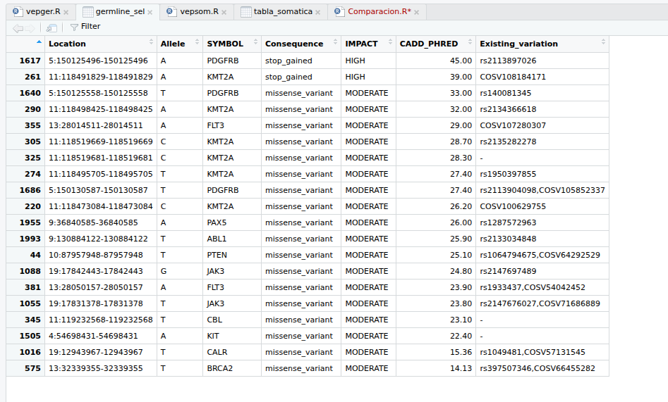
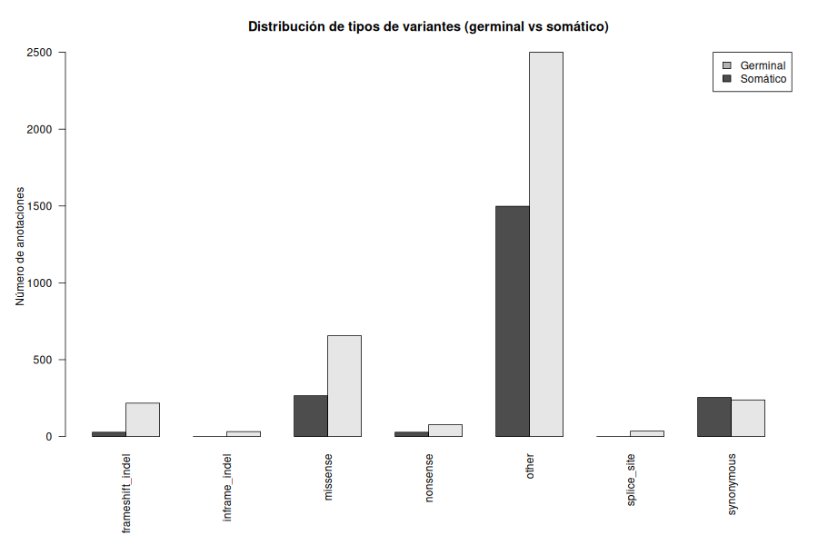

# Tarea 3, Unidad 5

## José de la Fuente R. Muestra S6.

### Introducción


### Métodología. 

Para la realización de este práctico, se usaron los scripts `sarek_germinal`y `sarek_somatico`. En ellos se fijó la ruta de los Reads y del fichero de salida, los scripts se encuentran en la carpeta `code`.  Para poder correr los scripts, es necesario activar el ambiente Sarek con `pyenv activate sarek_taller-pyenv` en el servidor de `bioinfo1`. 

Luego para correr el análisis germinal se usó el siguiente comando:
```
bioinfo1@genoma:~/jdelafuente/pipeline_sarek/code$ bash sarek_germinal.sh S6_R1.fastq.gz S6_R2.fastq.gz ../results

```

El comando para analisis somático y su directorio de ejecución.


```
bioinfo1@genoma:~/jdelafuente/pipeline_sarek/code$ bash sarek_somatic.sh S6_R1.fastq.gz S6_R2.fastq.gz ../results
```

Los resultados de los pipelines se guardaron en la carpeta `results` dentro del servidor y que a su vez se encuentran separados en las carpetas `gs6`y `ss6`respectivamente para cada uno de los análisis.
Al analizar los reportes de MultiQC para el análisis [germinal](https://josedelafuenter22.github.io/Tareas_BioninfoRepro2025_jfdr/Unidad3/Tarea5/reports/Reporte_multiqc_germ.html) y [somaático](https://josedelafuenter22.github.io/Tareas_BioninfoRepro2025_jfdr/Unidad3/Tarea5/reports/Reporte_multiqc_som.html), se puede observar que en ambos casos la calidad de las lecturas en ambos pipelines de Sarek, con un porcentaje de mapeo superior al 99% en ambos casos, a pesar de que existe alto porcentaje de duplicación de lecturas, lo cual hace tener en consideración al hacer los filtros para el análisis de variantes.

Para el llamado de variantes, se tomaron los archivos VCF generados por `Haplotypecaller`y `mutect2`llamados `S6.haplotypecaller.filtered.vcf`y `S6.mutect2.filtered.vcf.gz`y fueron cargados a la plataforma [VEP](https://www.ensembl.org/info/docs/tools/vep/index.html), para así poder distiguir entre aquellas variantes no sinónimas, que tengan un impacto Moderado/Alto y aquellas que estén relacionadas con cáncer. El ensamblaje se hizo sobre le genoma de referencia `GRCh38.p14`. Con los resultados obtenidos desde VEP, se obtuvieron archivos .txt, los cuales fueron procesados en R para obtener lo anterior. También se descargaron los VCF anotados desde VEP, los cuales se muestran en la carpeta `vcf`

Se usaron los siguientes scripts para el análisis de variantes en R tanto para [germinal](https://github.com/josedelafuenter22/Tareas_BioninfoRepro2025_jfdr/blob/main/Unidad3/Tarea5/code/vepger.R) y [somático](https://github.com/josedelafuenter22/Tareas_BioninfoRepro2025_jfdr/blob/main/Unidad3/Tarea5/code/vepsom.R). Con ellos fue posible obtener las siguientes tablas informativas sobre las variantes germinales y somáticas respectivamente:

<figure >
  
  <figcaption>
    <b>Figura 1.</b> Tabla de variantes germinales.</figcaption>
</figure>  

<figure >
  
  <figcaption>
    <b>Figura 2.</b> Tabla de variantes somáticas.</figcaption>
</figure>  


### Análisis global

Para poder realizar el análisis global, se utilizó el siguiente [script](https://github.com/josedelafuenter22/Tareas_BioninfoRepro2025_jfdr/blob/main/Unidad3/Tarea5/code/Comparacion.R) en R:

A nivel de anotaciones globales —considerando todos los transcritos y consecuencias generados por VEP— se identificaron 2074 anotaciones germinales y 3755 anotaciones somáticas.
Al restringir el análisis a variantes únicas definidas por CHROM + POS + Allele, se obtuvieron 123 variantes germinales frente a 241 variantes somáticas, lo que indica que el conjunto somático contiene aproximadamente el doble de variantes que el germinal. 

Al comparar los tipos de variantes se puede notar que en el caso de las variantes germinales, la mayoría de las anotaciones corresponde a regiones intrónicas, intergénicas o reguladoras (“other”), y dentro de las variantes codificantes predominan los cambios missense, con una menor proporción de mutaciones de alto impacto, como frameshift o stop_gained.

En cambio, el conjunto somático muestra un enriquecimiento marcado en variantes potencialmente disruptivas, entre ellas:

* un mayor número de missense,

* un aumento significativo de frameshift indels,

* más variantes nonsense,

* y la presencia de inframe indels y cambios en sitios de splicing, los cuales son prácticamente ausentes en el germinal.

Este patrón es coherente con el comportamiento esperado: mientras las variantes germinales suelen ser toleradas por el organismo, las variantes somáticas incluyen eventos funcionalmente dañinos que favorecen la proliferación tumoral, la inestabilidad del genoma o la evasión de mecanismos regulatorios.

A partir de las variantes únicas, se observó que el germinal presenta variantes en 26 genes, mientras que el análisis somático abarca 31 genes.
Los 26 genes presentes en el germinal también se encuentran mutados en el conjunto somático, lo que refleja que Mutect2 —al ejecutarse en modo tumor-only— detecta tanto mutaciones verdaderamente somáticas como variantes constitucionales del individuo.

Entre los genes compartidos destacan múltiples loci ampliamente asociados al cáncer, tales como TP53, BRCA1, BRCA2, FLT3, JAK2, JAK3, KMT2A, KIT, PDGFRB, CEBPA, ABL1, EZH2 y otros relacionados con proliferación, apoptosis, diferenciación y mantenimiento del genoma.

A nivel de variante exacta (misma posición y alelo), se identificaron 59 variantes compartidas entre ambos análisis. Estas corresponden mayoritariamente a variantes germinales que son detectadas también como “somáticas” debido a la ausencia de muestra normal pareada. De este modo, no representan mutaciones adquiridas independientes, sino variantes constitucionales reflejadas en ambos pipelines.

<figure >
  
  <figcaption>
    <b>Figura 3.</b> Distribución tipos de variantes germinal vs somático.</figcaption>
</figure>  


### Implicancias biológicas y clínicas


El genoma germinal contiene variantes principalmente del tipo missense en genes críticos, configurando un posible trasfondo de susceptibilidad o un estado basal de vulnerabilidad en procesos como reparación del DNA, regulación epigenética o señalización tirosina-quinasa.

El genoma somático, por otro lado, exhibe un perfil caracterizado por mutaciones de alto impacto (frameshift, nonsense, splice), compatibles con eventos impulsores de la transformación tumoral y que afectan genes centrales en oncogénesis, tales como KRAS, BRCA1/2, KMT2A, PDGFRB, KIT y ABL1.

La coincidencia de genes mutados en ambos contextos sugiere posibles escenarios tipo “two-hit”, donde una mutación germinal es complementada por un evento somático posterior, generando pérdida completa de función o activación aberrante de rutas clave.


### Análisis de variantes

Al analizar las variantes germinales, se identificaron 20 variantes con impacto MODERATE o HIGH, con 18 de ellas con valores de CADD sobre 20 lo que son indicativas de alta probabilidad de daño funcional, los cuales afectan a genes relacionados con la señalización celular y predisposición genética al cáncer. En resumen la distribución de los tipos de variaciones es:

* missense_variant: 19/20 (95%)

* stop_gained: 1/20 (5%)


Las variantes germinales se localizaron en:

* PDGFRB (2 variantes)

* KMT2A (6 variantes)

* FLT3 (2 variantes)

* JAK3 (2 variantes)

* CBL (1 variante)

* PTEN (1 variante)

* PAX5 (1 variante)

* ABL1 (1 variante)

* KIT (1 variante)

* CALR (1 variante)

* BRCA2 (1 variante)


Genes como BRCA2, PTEN, KMT2A, PDGFRB y KIT son relevantes para predisposición hereditaria, procesos epigenéticos y señalización de tirosina-quinasas.

El análisis de las variantes somáticas, todas presentaron un impacto alto, con una distribución como se muestra a continuación:


* stop_gained / stop_lost: 7 variantes (35%)

* frameshift_variant: 10 variantes (50%)

* splice-site variant: 2 variantes (10%)

* stop_gained + NMD combinada: 1 variante (5%)

Los genes afectados por estas variantes son:

* KMT2A (4 variantes)

* CBL (2 variantes)

* BRCA2 (4 variantes)

* BRCA1 (3 variantes)

* KRAS (2 variantes)

* PDGFRB, KIT, JAK2, JAK3, ABL1 (una variante cada uno)

Las variantes somáticas presentan mutaciones truncantes y framshift principalmente, lo que afecta la función de genes tales como BRCA1/2, CBL, ABL1 por ejeplo.


### Genes compartidos entre germinal y somático:


| Gene          | Germinal               | Somático                               | Tipo de impacto            |
| ------------- | ---------------------- | -------------------------------------- | -------------------------- |
| **PDGFRB**    | missense               | stop_gained                            | segundo golpe somático     |
| **KMT2A**     | múltiples missense     | múltiples truncantes                   | progresión tumoral         |
| **CBL**       | missense               | stop_gained                            | pérdida de función tumoral |
| **BRCA2**     | missense               | stop/frameshift                        | reparación de ADN alterada |
| **KIT**       | missense               | frameshift+splice                      | activación vía RTK         |
| **ABL1**      | missense               | frameshift                             | impacto en señalización    |
| **JAK3/JAK2** | germinal JAK3 missense | somático JAK3 splice + JAK2 frameshift | vía JAK-STAT alterada      |


Germinal: predominan variantes missense que afectan funcionamiento proteico sin truncarlo totalmente.

Somático: predominan variantes truncantes que eliminan por completo la función del gen.

Esto es un patrón típico del modelo de dos golpes (Knudson), donde:

Un alelo germinal presenta una mutación de predisposición (missense).

El alelo somático recibe una mutación severa (frameshift/stop) que desencadena la transformación tumoral.

### Implicancias biológicas

BRCA2 aparece mutado en germinal (missense) y somático (frameshift/stop) y BRCA1 presenta múltiples mutaciones truncantes somáticas. Lo anterior sugiere deficiencia en recombinación homóloga, ya que se ve afectada la capacidad de reparar el DNA.

Las variantes afectan fuertemente:

* JAK-STAT: JAK2, JAK3, CALR, PAX5

* Tirosina-quinasas: KIT, PDGFRB, FLT3, ABL1

* RAS/MAPK: KRAS (solo somático)

La aparición de KRAS mutado exclusivamente en el tumor confirma la adquisición de drivers somáticos responsables de proliferación desregulada.


KMT2A presenta mutaciones tanto germinales (missense) como somáticas (stop/NMD).
KMT2A es clave en:

* remodelación de cromatina

* regulación de transcripción

* leucemogénesis

Su afectación bialélica sugiere un proceso oncogénico dependiente de desregulación epigenética.


Las variantes germinales identificadas afectan principalmente genes que participan en reparación de ADN (BRCA2, PTEN), señalización hematopoyética (FLT3, KIT, PDGFRB, JAK3) y regulación epigenética (KMT2A). Aunque la mayoría son missense, varias presentan altos puntajes CADD (>25), lo que indica efecto funcional potencialmente perjudicial.

El conjunto somático, en contraste, está enriquecido en mutaciones nonsense y frameshift, típicas de pérdida de función en supresores tumorales. La presencia de mutaciones recurrentes en BRCA1/2 refuerza la hipótesis de un estado de deficiencia en reparación por recombinación homóloga, facilitando la acumulación de mutaciones adicionales.

La aparición de mutaciones en KRAS exclusivamente en el tumor destaca un driver somático clave, responsable de la activación constitutiva de la vía RAS/MAPK. Por otro lado, la afectación tanto germinal como somática de KMT2A, PDGFRB, CBL, KIT y ABL1 sugiere la existencia de un mecanismo de tipo double-hit, consistente con el modelo de Knudson, donde una mutación germinal sensibiliza al gen y una segunda mutación somática lo inactiva completamente.

---

## Búsqueda en OncoKB y gnomAD


Para el analisis de las variantes somáticas en OncoKB, se generó la siguiente tabla resumen: 

| Gen   | Variante                         | Oncogenicidad | Nivel de evidencia | Cánceres asociados    | Información terapéutica                                  |
|-------|----------------------------------|---------------|--------------------|-----------------------------------------------|----------------------------------------------------------|
|  BRCA2     |    Ser1630GlnfsTer6                              |     Likely Oncogenic, Likely Loss-of-function          |      Level 1              |    Ovario, Prostata, Pancreático    | Nirapib, Olaparib, Rucaparib, Bevacizumab.
|KIT | Thr411LysfsTer6|Unknown Oncogenic Effect, Unknown Biological Effect| --|--|--
|PDGFRB|Gln586Ter|Unknown Oncogenic Effect,Unknown Biological Effect |--|--|--
|KMT2A|Trp1632Ter|Likely Oncogenic, Likely Loss-of-function|--|--|--
|KMT2A|Tyr3942Ter|Likely Oncogenic, Likely Loss-of-function|--|--|--
|KMT2A|Trp150Ter|Likely Oncogenic, Likely Loss-of-function|--|--|--
|BRCA1|Lys608AsnfsTer6|Likely Oncogenic, Likely Loss-of-function| Level 1| Ovario, prostata, pancreático, mama, peritoneal| Niparib, Olaparib, Talazoparib
|BRCA2| Leu769delinsGlnLeuTer| Likely Oncogenic, Likely Loss-of-function| Level 1| Peritoneo, Ovario, Prostata, Pancreático, Sarcoma Uterino, Cáncer de mamas| Olaparib, Rucaparib, Niraparib, Talazoparib
|BRCA2|Lys1631GlnfsTer8|Likely Oncogenic, Likely Loss-of-function | Level 1 | Peritonal, Ovarios, Prostata,Pancreático, Uterino, Cáncer de mamas | Olaparib, Rucaparib, Niraparib, Talazoparib
|BRCA1|Lys607GlufsTer4|Likely Oncogenic, Likely Loss-of-function| Level 1| Peritonal, Ovarios, Prostata,Pancreático, Uterino, Cáncer de mamas | Olaparib, Rucaparib, Niraparib, Talazoparib
|ABL1|Glu883Ter|Unknown Oncogenic Effect, Unknown Biological Effect|--|--|--
|CBL|Lys124Ter|Likely Oncogenic, Likely Loss-of-function| Level Dx2| Leucemia|--
|CBL| Arg101Ter| Likely Oncogenic, Likely Loss-of-function| Level Dx2| Leucemia|--
|KMT2A| Gln298Ter| Likely Oncogenic, Likely Loss-of-function|--|--|--
|BRCA2|Lys1636Ter|Likely Oncogenic, Likely Loss-of-function| Level 1|  Peritonal, Ovarios, Prostata,Pancreático, Uterino, Cáncer de mamas | Olaparib, Rucaparib, Niraparib, Talazoparib
|JAK2|Lys502LeufsTer13|Unknown Oncogenic Effect, Unknown Biological Effect|--|--|--
|KRAS|Ter190delinsTrpArgGlySerGluIleIleLys| Unknown Oncogenic Effect, Unknown Biological Effect|--|--|--
|BRCA1|Leu512LysfsTer11|Likely Oncogenic, Likely Loss-of-function| Level 1| Peritonal, Ovarios, Prostata,Pancreático, Uterino, Cáncer de mamas | Olaparib, Rucaparib, Niraparib, Talazoparib
---

Para el análisis de las variantes germinales, se creó la siguiente tabla con los datos de gnomAD:

| Gen   | Variante                         | Frecuencia global | Frecuencia por población                      | Rareza                  |
|-------|----------------------------------|-------------------|-----------------------------------------------|-------------------------|
KMT2A|p.Trp1632Ter|0.000007435| - Europea no finlandesa: 0.00001017| Muy rara
|PDGFRB|Arg565Gln|0.000006196| Africana: 0.00005330, Europea no finlandesa: 0.000002543, Asia del sur: 0.00001098| Muy rara
|PAX5| p.Ala384Val| 0.000001260| Mezcla americano: 0.00001815, Europea no finlandesa: 8.561e-7| Muy rara
|ABL1| p.Ala611Val| 0.000001859| Asia oriental: 0.00002228, Europeo no finlandesa: 0.000001695| Muy rara
|PTEN| p.Pro244Ser| 6.195e-7| Asia del sur: 0.00001098| Muy rara
|FLT3| p.Thr227Met | 0.6080| Asia oriental: 0.7625, Asia del sur: 0.6444, Europea no finlandesa: 0.6188, Europea finlandesa: 0.6069, Mezcla americano: 0.5942, Judios: 0.5848, Amish: 0.5670, Medio oriente: 0.4716, Africano: 0.3381 | Común
|JAK3| p.Arg943His| 6.226e-7| Europea finlandesa: 0.00001768| Muy rara
|CALR| p.Gly375Cys| 0.5992| Asia oriental: 0.8109, Europeo finlandesa: 0.6913, Asia del sur: 0.6903, Judío: 0.6643, Medio oriente: 0.6198, Europeo no finlandesa: 0.5900, Amish: 0.5691, Mezcla americano: 0.5272, Africana: 0.4560| Común
---


Importante mencionar que de las 20 variantes seleccionadas, solamente las mostradas en la tabla anterior estaban registradas en gnomAD. 


## Discusión

 A nivel global, el número de variantes únicas es aproximadamente el doble en el análisis somático que en el germinal (241 vs 123), y el espectro de consecuencias se desplaza desde variantes missense  hacia un gran número de eventos truncantes (frameshift, stop_gained/stop_lost), indels en marco y mutaciones que afectan sitios de splicing. Este enriquecimiento en variantes de alto impacto en el tumor concuerda con el concepto de que las células neoplásicas acumulan mutaciones que alteran de manera drástica genes implicados en control del ciclo celular, reparación de ADN y señalización proliferativa.

El hecho de que los 26 genes con variantes germinales también presenten variantes somáticas, y que además se identifiquen 59 variantes exactas compartidas (misma posición y alelo), se explica bien por la estrategia de llamado tumor-only con Mutect2: en ausencia de una muestra normal pareada o de un panel of normals, las variantes constitucionales y ciertos artefactos técnicos tienden a “colarse” en el llamado somático, por lo que parte del catálogo somático corresponde en realidad a variantes germinales o recurrentes de fondo.

Desde el punto de vista funcional, los genes afectados pertenecen a ejes clave de la oncogénesis hematológica:

* Reparación de ADN por recombinación homóloga: BRCA1 y BRCA2 concentran múltiples mutaciones truncantes somáticas, mientras que BRCA2 presenta además una variante missense germinal con alto CADD. Esto es coherente con un estado de deficiencia en recombinación homóloga (HRD), que se asocia a inestabilidad genómica y sensibilidad a inhibidores de PARP en tumores de mama, ovario, próstata y páncreas.

* Regulación epigenética y cromatina: KMT2A (MLL) muestra un patrón bialélico de daño (múltiples missense germinales y truncantes somáticas). KMT2A es un regulador epigenético central, y sus alteraciones se han descrito como drivers en diversas leucemias y síndromes mielodisplásicos.

* Señalización tirosina-quinasa y vías JAK-STAT / RAS-MAPK: variantes en FLT3, KIT, PDGFRB, JAK2, JAK3, CBL, ABL1 y KRAS afectan de manera directa o indirecta vías de señalización proliferativa. Mutaciones en JAK2, CALR y JAK-STAT se han relacionado con activación constitutiva de la vía y desarrollo de neoplasias mieloproliferativas.
  
 En este contexto, la presencia de KRAS mutado exclusivamente en el tumor sugiere un driver somático clásico de activación de la vía RAS/MAPK.

Las anotaciones clínicas de OncoKB refuerzan la relevancia de varias de estas variantes. Múltiples truncamientos en BRCA1/2 aparecen clasificados como “likely oncogenic” y “loss-of-function”, con nivel de evidencia 1 para sensibilidad a inhibidores de PARP en tumores de mama, ovario, próstata y páncreas, entre otros.

 En contraste, para variantes truncantes en KIT, PDGFRB, ABL1 o JAK2, la base de datos reporta con frecuencia “unknown oncogenic effect”, lo que refleja vacíos de evidencia funcional o clínica a pesar del alto impacto estructural de la mutación. Lo anterior refleja que los blancos terapéuticos están dirigidos a ciertos genes, como BRCA1/2, versus otros que no se posee tanta evidencia clínica acumulada.

El análisis de gnomAD aporta una capa complementaria de interpretación basada en frecuencia poblacional. La mayoría de las variantes germinales seleccionadas se clasifican como “muy raras” (frecuencias globales del orden de 10⁻⁶–10⁻⁵), lo que, en el marco de las guías ACMG/AMP, respalda su potencial patogénico (criterio PM2: ausencia o frecuencia extremadamente baja en poblaciones de referencia).

En contraste, variantes como FLT3 p.Thr227Met o CALR p.Gly375Cys muestran frecuencias ~0.6 en gnomAD, distribuidas de forma relativamente uniforme entre múltiples poblaciones, lo que es compatible con variantes comunes probablemente benignas, pese a su ubicación en genes relevantes para cáncer.

El genoma del paciente presenta un trasfondo de susceptibilidad (variantes germinales raras con potencial efecto funcional), sobre el cual el tumor acumula eventos somáticos de alto impacto que consoliden la transformación neoplásica, en línea con la hipótesis de los “dos golpes” de Knudson para genes supresores de tumor.

Como limitaciones principales, el análisis se basa en una sola muestra tumoral y un solo conjunto germinal, el llamado somático se hizo en modo tumor-only sin panel de normales, y se trabajó solo con variantes puntuales/indels anotadas por VEP, sin considerar alteraciones estructurales.

## Conclusiones

El tumor presenta aproximadamente el doble de variantes únicas que el genoma germinal, con un claro enriquecimiento en mutaciones de alto impacto (frameshift, stop_gained/stop_lost, splice), mientras que el germinal está dominado por variantes missense y anotaciones intrónicas o reguladoras.Este patrón es consistente con la acumulación de drivers somáticos sobre un trasfondo germinal mayoritariamente tolerado. Además fue posible identificar variantes recurrentes en genes clave de reparación de ADN (BRCA1/2, PTEN), regulación epigenética (KMT2A, EZH2) y señalización hematopoyética/proliferativa (FLT3, KIT, PDGFRB, JAK2/JAK3, CBL, ABL1, KRAS). La coincidencia de mutaciones germinales y somáticas en varios de estos genes sugiere mecanismos bialélicos de inactivación o desregulación, compatibles con el modelo de “dos golpes” para genes supresores de tumor. Las variantes truncantes en BRCA1/2 están respaldadas por evidencia de nivel 1 en OncoKB como alteraciones loss-of-function asociadas a sensibilidad a inhibidores de PARP, lo que marca la importancia de reconocer un posible estado de deficiencia en recombinación homóloga. Para otros genes truncados (KIT, PDGFRB, ABL1, JAK2), la evidencia clínica es mucho más limitada, lo que expone la necesidad de estudios funcionales y clínicos adicionales antes de proponer intervenciones específicas.La mayoría de las variantes germinales potencialmente relevantes son muy raras o ausentes en gnomAD, lo que, de acuerdo con las guías ACMG/AMP, refuerza su posible contribución patogénica.En contraste, variantes comunes en FLT3 y CALR probablemente representan polimorfismos sin impacto clínico mayor, pese a su localización en genes de interés oncológico.
