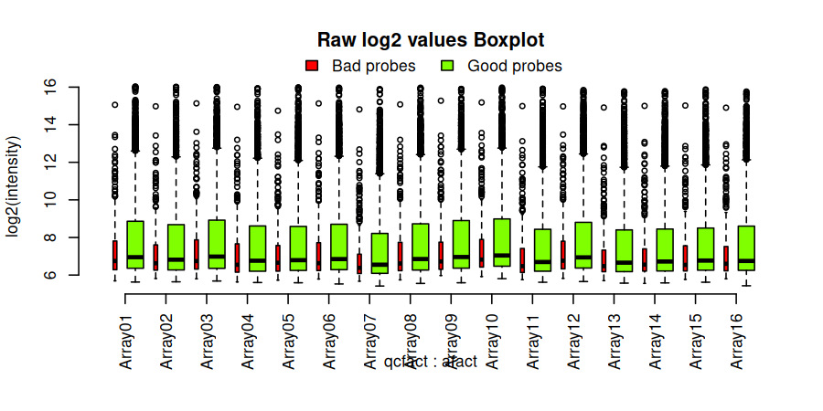
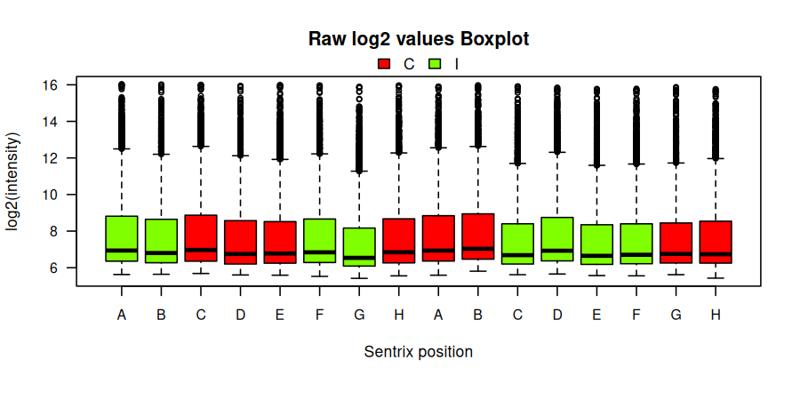
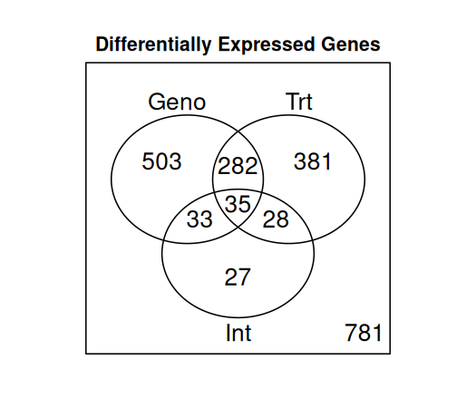
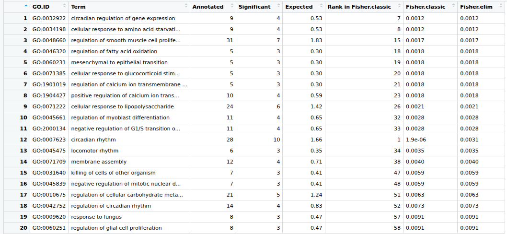

# Unidad 4, sesión 1

## Expresión diferencial

### José de la Fuente.

Para llevar a cabo este trabajo, se realizaron las siguientes modificaciones a lo expuesto en el tutorial:

* Se usó inicialmente los archivos `Illum_data.txt` y `MouseRef-8_annot_full.txt` , de los cuales se obtuvo una muestra aleatoria de 5000 filas separado por tabulaciones, a través del siguente código en R:

```r
set.seed(12)

# Leer archivos completos
Data.Full  <- read.delim("Illum_data.txt", check.names = FALSE)
Annot.Full <- read.delim("MouseRef-8_annot_full.txt", check.names = FALSE)

# Alinear anotación con datos de expresión
Annot.Full <- Annot.Full[match(Data.Full$PROBE_ID, Annot.Full$ProbeID), ]

# Verificación de seguridad
stopifnot(all(Data.Full$PROBE_ID == Annot.Full$ProbeID))

# Muestreo aleatorio de 5000 PROBE_ID
ids5000 <- sample(Data.Full$PROBE_ID, size = 5000, replace = FALSE)

# Subconjuntar SOLO por filas (sondas)
Data.Sample  <- Data.Full[Data.Full$PROBE_ID %in% ids5000, ]
Annot.Sample <- Annot.Full[Annot.Full$ProbeID %in% ids5000, ]

# Reordenar para mantener correspondencia exacta
Data.Sample  <- Data.Sample[order(Data.Sample$PROBE_ID), ]
Annot.Sample <- Annot.Sample[match(Data.Sample$PROBE_ID, Annot.Sample$ProbeID), ]

# Guardar archivos listos para el pipeline original
write.table(Data.Sample,
            file = "Illum_data_sample5000.txt",
            sep = "\t", quote = FALSE, row.names = FALSE)

write.table(Annot.Sample,
            file = "MouseRef-8_annot_sample5000.txt",
            sep = "\t", quote = FALSE, row.names = FALSE)
```

* Se consideró presente el transcrito cuando este se detectó en al menos un 25% de las muestras en todos los grupos experimentales, para ello se hizo lo siguiente:

```r
table(design$Group) 

B.C B.I BY.C BY.I 
4 4 4 4
```

Con lo anterior, se pudo determinar que hay 4 muestras en cada grupo experimental, por lo que el 25% corresponde a 1, dando asi la siguiente modificación del código del pipeline para cumplir la con condición:

```r
probe_present      <- Data.Raw[,detection] < 0.04
detected_per_group <- t(apply(probe_present, 1, tapply, design$Group, sum))
min25 <- 1 
present <- apply(detected_per_group >= min25, 1, all)
normdata <- normdata[present,]
annot    <- annot[present, ]
```

* Se usaron 500 permutaciones con el siguiente bloque: 

```r
test.cmat <- matest(madata, fit.fix, term="Group", Contrast=cmat, n.perm=500, test.type = "ttest",
                    shuffle.method="sample", verbose=TRUE)
```

* Se usó una tasa de falsos descubrimiento (FDR) de 0,19:

```r
fdr_th     <- 0.19 
```

* Finalente, un gen fue seleccionado cuando todas las sondas están asociadas a este:

```r
Genes.DE  <- apply(Probes.DE, 2, tapply, results$GeneID, all)

Genes.Int_Geno <- apply(Probes.Int_Geno, 2, tapply, results$GeneID[results$FDR.Int <= fdr_th], all)

Genes.Int_Trt  <- apply(Probes.Int_Trt, 2, tapply, results$GeneID[results$FDR.Int <= fdr_th], all)

genes.int <- tapply(probes.int, results$EntrezID, all)
```

Realizado lo anterior, se corrió el script [Full.R](https://github.com/josedelafuenter22/Tareas_BioninfoRepro2025_jfdr/blob/main/Unidad4/Sesion1/scripts/Full.R) del cual se analizarán los resultados por cada bloque del script.

---

## Analisis control de calidad previo al filtrado.

Las figuras obtenidas de este bloque fueron las siguientes:

<figure >
  
  <figcaption>
    <b>Figura 1.</b> Boxplot de valores sin filtrar según calidad de sonda.</figcaption>
</figure>  

<figure >
  
  <figcaption>
    <b>Figura 2.</b> Boxplot por tratamiento sin filtrar.</figcaption>
</figure>  

<figure >
  
  <figcaption>
    <b>Figura 3.</b> Scatter plot entre arreglos.</figcaption>
</figure>  

De la figura 1 es posible observar que la clasificación entre `Bad probes` y `Good probes` es eficiente, ya que estas últimas presentan mayor intesidad de señal y una distribución más amplia, lo que refuerza el filtrado para los siguientes análisis. Al analizar la figura 2, se observa que no existen diferencias entre los tratamientos de castración e intactos, lo que indica que el randomizado experimental reduce los sesgos técnicos asociados a los tratamientos. Finalmente en la figura 3, los diagramas entre los arreglos se observan diagonales en todos los pares de arreglos, por lo que se puede afirmar que existe un alto grado de correlación entre los pares, sin evidencia de outliers. En resumen, el control de calidad de los datos crudos muestra una gran concordancia entre muestras y con distribuciones similares entre tratamientos. El filtrado de sondas de baja calidad muestran señales muy menores a las de buena calidad, lo que refuerza el criterio de exclusión. Lo anterior da una buena base para realizar análisis posteriores con el set aleatorio de datos.

## Filtrado de sondas.

```r
> sum(probe_qc == "Good probes")
 4746

 > sum(present)
 2211

```

Con los filtrados realizados de las 5000 sondas inciales, se obtuvo que aquellas clasificadas como `Good probes` corresponden a 4.746 y de estas, luego de aplicado del filtro del 25% de las muestras en cada grupo experimental, este número se redujo a 2.211, lo que corresponde a que finlmente el conjunto de datos a trabajar es de  aproximadamente un 44% con respecto a las sondas inciales. 

## Efecto de la normalización.

Para realizar la comparación, se obtuvieron los siguientes boxplots antes y después de la normalización, para observar el efecto de ésta. Para ello se ejecutaron los siguientes códigos en R:

```r
par(mar = c(6, 4, 2, 1), cex = 0.7)

boxplot(
  log2(rawdata),
  las  = 2,
  main = "Raw log2 intensity values (before normalization)",
  ylab = "log2(intensity)"
)

```

```r
par(mar = c(6, 4, 2, 1), cex = 0.7)

boxplot(
  log2(normdata),
  las  = 2,
  main = "Log2 intensity values (after quantile normalization)",
  ylab = "log2(intensity)"
)

```

El resultado fue el siguiente:

<figure >
  
  <figcaption>
    <b>Figura 4.</b> Boxplot de datos prenormalización.</figcaption>
</figure>  

<figure >
  
  <figcaption>
    <b>Figura 5.</b> Boxplot de datos postnormalización.</figcaption>
</figure>  

Al comparar las figuras 4 y 5, se puede notar que la normaliación eliminó la diferencia entre los arreglos, reduciendo de esta forma el efecto del ruido técnico y teniendo datos disponibles para una comparación y análisis para la expresión diferencial. 

## Pruebas de expresión diferencial (p-values).

La figura obtenida fue la siguiente: 


<figure >
  
  <figcaption>
    <b>Figura 6.</b> Histogramas de p-values.</figcaption>
</figure>  

Como se puede observar en la figura 6, ninguna de las curvas es uniforme y se encuentrar en torno al 0, lo que indica la existencia de efectos biológicos reales en las sondas. Al analizar por separado, el genotipo indica que el cromosoma Y tiene efectos sobre la expresión génica cardiaca. Por otro lado el tratamiento de castración también afecta la expresión génica. Finalmente, la interacción entre ambas, nos muestra que la respuesta al tratamiento depende del genotipo, es decir, que el efecto del cromosoma Y sobre la expresión génica, dependen del estado hormonal del animal. 

## Resultados de la expresión diferencial.

Desde R se obtuvieron los siguientes resultados de la expresión diferencial:

```r
 cat("Geno:", sum(results$FDR.Geno <= fdr_th), "\n")
Geno: 947 
cat("Trt :", sum(results$FDR.Trt  <= fdr_th), "\n")
Trt : 799 
cat("Int :", sum(results$FDR.Int  <= fdr_th), "\n")
Int : 138 
```

El resultado del análisis de expresión diferencial, considerando una FDR &le; 0,19, muestra efectos significativos tanto del tratamiento como del genotipo, con 947 y 799 sondas respectivamente. Además existen 138 sondas que mostraron una interacción significativa entre genotipo y tratamiento, lo que muestra que la respuesta a nivel de transcritos a la castración difiere entre los genotipos analizados. Los resultados anteriores pueden sugerir que los efectos del cromosoma Y sobre la expresión génica a nivel cardíaco están de parcialmente determinados por los niveles hormonales. 

## Diagramas de Venn para la expresión diferencial de genes.

Los diagramas de Venn obtenidos fueron los siguientes:

<figure >
  
  <figcaption>
    <b>Figura 7.</b> Diagrama de Venn para genes expresados diferencialmente.</figcaption>
</figure>  

<figure >
  
  <figcaption>
    <b>Figura 8.</b> Diagrama de Venn para genes expresados según tratamiento y genotipo.</figcaption>
</figure>  

La figura 7 muestra la expresión diferencial de genes y ellos se puede nota que el genotipo es quien explica la mayor fracción de la variación transcripcional, mostrando que el cromosoma Y tiene un alto impacto en la expresión génica cardiaca. Por otro lado, 381 genes responden exclusivamente a la castración, lo que refleja que la regulación génica es dependiente a la testosterona entre dichos genes  y 27 es exclusivo a la interacción, lo que implica que no pueden ser explicado ni por el genotipo ni por el tratamiento, lo que podría dar candidatos que expliquen una posible diferencia dependientes de la testosterona mediadas por el cromosoma Y. 

En cuanto a la figura 8, el panel de la izquierda muestra los genes que responden según el tipo de tratamiento. Como se puede observar, la mayoría surge después de la castración, lo que podría sugerir que los niveles testosterona modula diferencias entre cromosomas Y, ya que al removerla surgen diferencias genotípicas. El panel de la derecha en cambio, muestra el efecto del tratamiento en los genotipos B y BY, donde en este último se observa un efecto mayor con respecto al tratamiento, lo que podría indicar que existe una mayor interacción entre el cromosoma Y y el estado hormonal. 

## Análisis de enriquecimiento funcional. 

El analisis funcional con topGO, dió como resultado la siguiente tabla:

<figure >
  
  <figcaption>
    <b>Figura 9.</b> Tabla de análisis funcional.</figcaption>
</figure>  


El análisis de enriquecimiento funcional de los genes, muestra 20 genes que poseen una sobrerrepresentación, con p-valor inferior a 0,01. mostrando interacciones significativas entre genotipo x tratamiento, procesos vinculados a la regulación del ciclo circadiano, metabolismo energético y función muscular cardíaca, entre otros, lo que sugiere que variaciones en el cromosoma Y modulan respuestas transcripcionales del corazón según el estado hormonal.

---
## Conclusiones 

De las 5000 sondas escogidas al azar, existe un amplio efecto del genotipo, asociado al cromosoma Y sobre la expresión génica cardiaca, ya que se encontraron 947 sondas. Además, la castración también produce cambios a nivel transcripcional, lo que apoya la idea de que la testosterona o cambios endocrinos asociados a la castración, modulan la expresión génica en el corazón. Además existe interacción entre el tratamiento y el genotipo, por lo cual es posible pensar que la respuesta a la castración es dependiente del genotipo, ya que cambian según el estado hormonal. Además, se pudo evidenciar que la interacción no es simétrica, ya que BY responde más fuerte al tratamiento, relevando diferencias en los genotipos como respuesta a la castración, además de mostrar mayor sensibilidad a nivel transcriptómico, comparado con B. Los procesos que fueron enriquecidos tienen relación con una regulación cardíaca dependiente de hormonas, ya que se fue posible notar que procesos relacionados con la regulación cardíaca, metabolismo energético, procesos relacionados con la musculatura y respuestas hormonales o estrés, dan cuenta que la interacción cromosoma Y x testosterona podría tener impacto en las redes regulatorias asociadas a la fisiología cardíaca y potencialmente en el fenotipo del tamaño de los cardiomiocitos.


Se adjuntan los scripts utilizados para:

* [Muestra aleatoria de sondas](https://github.com/josedelafuenter22/Tareas_BioninfoRepro2025_jfdr/blob/main/Unidad4/Sesion1/scripts/Muestreo_aleatorio.R)
* [Pipeline de analisis de expresión diferencial](https://github.com/josedelafuenter22/Tareas_BioninfoRepro2025_jfdr/blob/main/Unidad4/Sesion1/scripts/Full.R)

Además de las [tablas](https://github.com/josedelafuenter22/Tareas_BioninfoRepro2025_jfdr/tree/main/Unidad4/Sesion1/tables) obtenidas del análisis de expresión diferencial.
