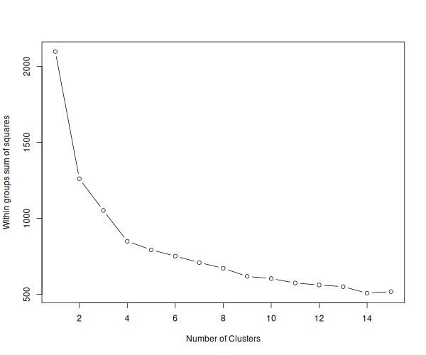
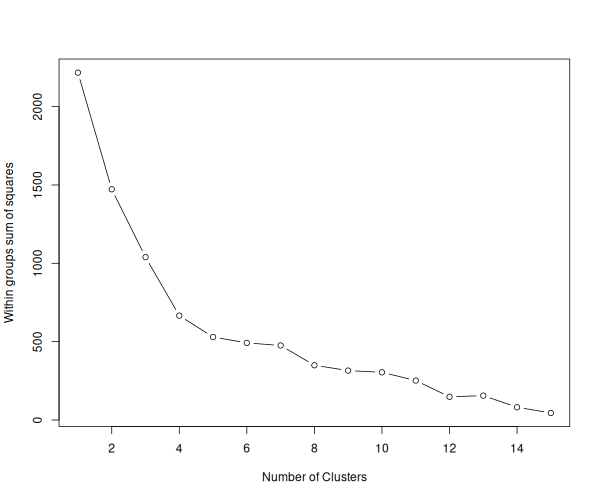
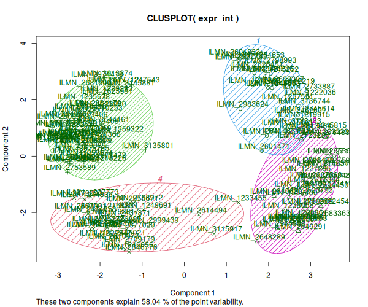
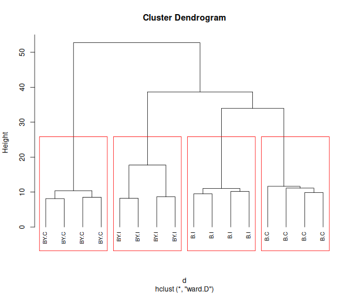
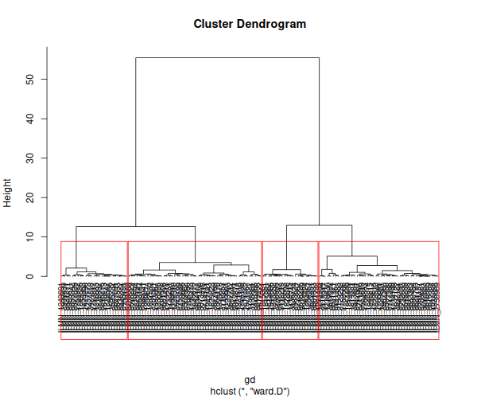

# Análisis de Clustering

## José de la Fuente R.


Para poder realizar el análisis de Clustering, en primer lugar desde el [script](https://github.com/josedelafuenter22/Tareas_BioninfoRepro2025_jfdr/blob/main/Unidad4/Sesion1/scripts/Full.R) de la actividad anterior, se procedió a filtrar aquellos genes de expresión diferencial por interacción. Para ello se usó el siguiente código:
```r

results_int <- results[results$FDR.Int <= fdr_th, ]
write.table(
   results_int,
     file = file.path(outdir, "DE_interaction_FDR019.txt"),
    sep = "\t",
    row.names = T
 )

```

Con ello se obtiene una tabla que podrá ser utilizada para el trabajo de este reporte. Es importante notar que la obtención de la tabla `results_int`arrojó valores distintos a los del trabajo 1, esto debido a la aleatoridad de las permutaciones del código empleado. Como resultado, esta vez se trabajaran con 141 sondas. 

Los datos se trataron preliminarmente con el siguiente código:

``` r
outdir     <- "output"

if(!file.exists(outdir)) {
  dir.create(outdir, mode = "0755", recursive=T)
}

Data.Raw  <- read.delim("Illum_data_sample5000.txt")
signal    <- grep("AVG_Signal", colnames(Data.Raw)) # vector de columnas con datos 
detection <- grep("Detection.Pval", colnames(Data.Raw))

annot     <- read.delim("MouseRef-8_annot_sample5000.txt")
probe_qc  <- ifelse(annot$ProbeQuality %in% c("Bad", "No match"), "Bad probes",
                    "Good probes")

design    <- read.csv("YChrom_design.csv")
print(design)

Data.Raw <- Data.Raw[probe_qc %in% "Good probes",]
annot    <- annot[probe_qc %in% "Good probes",]

rawdata           <- as.matrix(Data.Raw[,signal])
rownames(rawdata) <- Data.Raw$PROBE_ID
colnames(rawdata) <- design$Sample_Name

library(preprocessCore)
normdata           <- normalize.quantiles(rawdata) 
colnames(normdata) <- colnames(rawdata)
rownames(normdata) <- rownames(rawdata)

probe_present      <- Data.Raw[,detection] < 0.04
detected_per_group <- t(apply(probe_present, 1, tapply, design$Group, sum))
min25 <- 1 
present <- apply(detected_per_group >= min25, 1, all)
normdata <- normdata[present,]
annot    <- annot[present, ]

normdatalog<-log2(normdata)

write.table(normdatalog, file.path(outdir, "normdatalog.txt"), sep="\t", row.names=T)

mydata <- read.delim("output/normdatalog.txt", as.is=T)

design <- read.csv("YChrom_design.csv")
colnames(mydata) <- design$Group

mydata <- na.omit(mydata) # eliminación filas con faltantes
mydata <- t(scale(t(mydata))) # estandarizar variables por filas (sondas)
mydata1 <- scale(mydata) # estandarizar variables por columnas (muestras)

genes_int <- read.delim("DE_interaction_FDR019.txt", header = TRUE, as.is = TRUE)
ids <- genes_int[[1]]   
ids <- as.character(ids)
ids_ok <- intersect(ids, rownames(mydata))
ids_ok1 <-intersect(ids,rownames(mydata1))

expr_int <- mydata[ids_ok, , drop = FALSE ] #filtro por sondas de interacción
expr_int1 <- mydata1[ids_ok1, , drop = FALSE  ] #idem al anterior

write.table(expr_int, file.path(outdir, "normdatalog.int.filas.txt"), sep="\t", row.names=T)
write.table(expr_int1,file.path(outdir, "normdatalog.int.columnas.txt"), sep = "\t", row.names = T)

```

Con ello se combinó la tabla generada inicialmente con la utilizada en la actividad 1. Se generaron dos elementos, mydata y mydata1, en los cuales se escaló por sondas y por muestras, las cuales después se usarán como base para los analisis de WSS, PCA y cluster jerárquicos. 

## Determinación de k para sondas y muestras.

Para la determinación del valor de k, se usó el método del codo. En el caso de las sondas, el bloque de código fue el siguiente:

```r
wss <- (nrow(expr_int)-1)*sum(apply(expr_int,2,var))
for (i in 2:15) wss[i] <- sum(kmeans(expr_int,
                                     centers=i)$withinss)

png(file.path(outdir,"SSQ_by_K_using_kmeans_fil.png"), width=600, height=500)
plot(1:15, wss, type="b", xlab="Number of Clusters",
     ylab="Within groups sum of squares") 
dev.off()

```

El gráfico obtenido es el que se muestra a continuación:


<figure >
  
  <figcaption>
    <b>Figura 1.</b> Gráfico de WSS vs número de clústers para sondas.</figcaption>
</figure>  

Del gráfico anterior, se puede notar que para un valor de k=4, la curva se tiende a aplanar y desde ese valor en adelante, la disminución de los valores para WSS es mucho menor. Por lo que se usarán 4 clústers para hacer los análisis posteriores.

Para el caso del valor de k para las muestras, se empleó el siguiente código:

```r 
X<-t(expr_int1)
wss1 <- (nrow(X)-1) * sum(apply(X, 2, var))
for (i in 2:15) wss1[i] <- sum(kmeans(X,
                                     centers=i)$withinss)

png(file.path(outdir,"SSQ_by_K_using_kmeans_col.png"), width=600, height=500)
plot(1:15, wss1, type="b", xlab="Number of Clusters",
     ylab="Within groups sum of squares") 
dev.off()

```

Se generó un nuevo elemento (X), ya que kmeans asume que las filas son las observaciones, por lo que para analizar las muestras, es necesario transponer la matriz escalada. Como resultado de lo anterior, se obtuvo el siguiente gráfico:

<figure >
  
  <figcaption>
    <b>Figura 2.</b> Gráfico de WSS vs número de clústers para muestras .</figcaption>
</figure>  

Al igual que en el caso de las sondas, el valor de k en el cual la disminución de los valores de WSS se tiende a aplanar es 4, por lo que también se utilizará dicho valor para realizar los análisis de clustering.

Para verificar si el valor de k es adecuado, se procede a analizar el gráfico de componentes principales. Para ello se generaron gráficos con el siguiente código: 

```r
library(cluster)

png(file.path(outdir,"Clusplot_kmeans_k4.png"), width=600, height=500)
clusplot(expr_int, fit$cluster, color=TRUE, shade=TRUE,
         labels=2, lines=0)
dev.off()


library(factoextra)
png(file.path(outdir,"fviz_cluster_kmeans_k4.png"), width=600, height=500)
fviz_cluster(fit, data = expr_int)
dev.off()
```

Con ello se obtuvieron los siguientes gráficos:

<figure >
  
  <figcaption>
    <b>Figura 3.</b> Clusplot para k=4 para sondas .</figcaption>
</figure>  


<figure >
  
  <figcaption>
    <b>Figura 4.</b> Clusplot para k=4 con fviz para sondas .</figcaption>
</figure>  

Al analizar ambos gráficos, se puede notar que la elección del valor de k=4, generó grupos bien delimitados y separados entre si, con un nivel de solapamiento mínimo (figura 3). Entre las dos primeras componentes, se explica un 58% de la variación total, lo cual es normal en análisis de expresión diferencial. Lo anterior sugiere que existen distintos patrones de expresión génica, los cuales pueden estar vinculados a respuestas diferenciales entre genotipos y tratamientos. 

## Clúster jerárquico.

Para realizar este proceso en el caso de las muestras, se empleó el siguiente código:

```r
d <- dist(t(expr_int1), method = "euclidean") # distance matrix
fit <- hclust(d, method="ward.D")
png(file.path(outdir,"hclust_samples.png"), width=600, height=500)
plot(fit, hang = -1, cex = 0.8) # display dendogram
dev.off()


groups <- cutree(fit, k=4) # cut tree into 4 clusters
groups


png(file.path(outdir,"rect_hclust_samples.png"), width=600, height=500)
plot(fit, hang = -1, cex = 0.8) # display dendogram
rect.hclust(fit, k=4, border="red") 
dev.off()
```
Cómo resultado, se obtuvo el siguiente dendograma:


<figure >
  
  <figcaption>
    <b>Figura 5.</b> Dendograma jerárquico para muestras .</figcaption>
</figure>  

De la figura anterior, es posible observar que se los 4 grupos corresponden a cada una de las cepas, separadas según el tipo de tratamiento. La cercanía entre algunos grupos, podría ser indicador de que la respuesta al tipo de tratamiento depende del genotipo, lo cual apoya la existencia de una relación genotipo y tratamiento.

En el caso de las sondas, el código fue el siguiente:

```r
gd <- get_dist(expr_int, method ="pearson", stand=FALSE)
gfit <- hclust(gd, method="ward.D")
png(file.path(outdir,"hclust_genes.png"), width=600, height=500)
plot(gfit, hang = -1, cex = 0.8, labels = FALSE) # display dendogram
dev.off()


png(file.path(outdir, "rect_hclust_genes.png"), width = 600, height = 500)
plot(gfit, hang = -1, cex = 0.8)
rect.hclust(gfit, k=4, border="red")
dev.off()
```

Cuyo dendograma resultante fue:

<figure >
  
  <figcaption>
    <b>Figura 6.</b> Dendograma jerárquico para sondas.</figcaption>
</figure>  

El dendograma anterior muestra dos grandes grupos, los cuales se subdividen nuevamente en 2 módulos más pequeños de genes. Esta estructura podría indicar que existe un mecanismo de regulación coordinada entre dichos bloques de genes, lo cual puede estar vinculada a los tratamientos.
