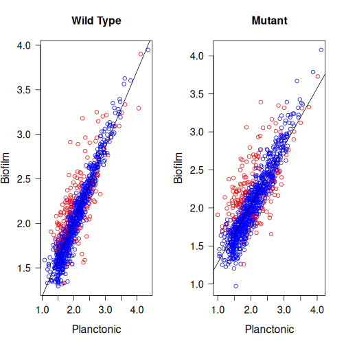
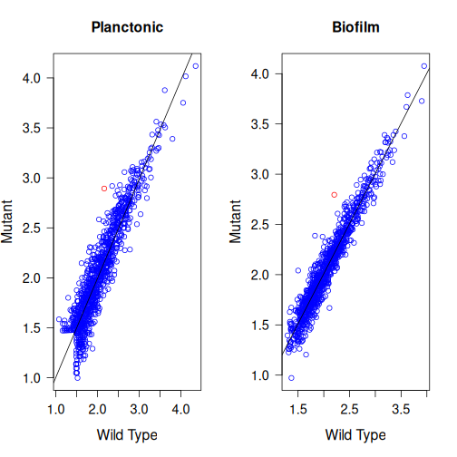
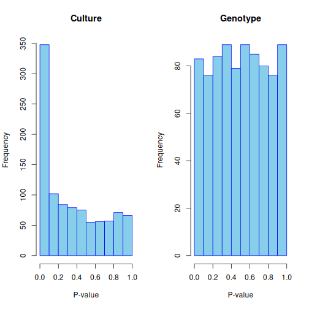
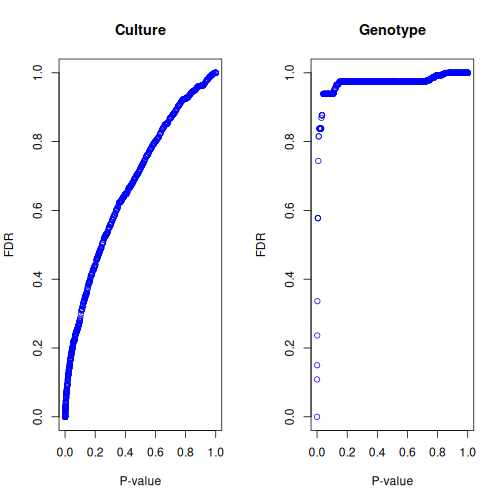

## Introducción

## Métodos

### Paso 1: Preparación del entorno de trabajo

En el servidor genoma.med.uchile.cl se procedió a realizar los siguientes comandos:

```         
cd jdelafuenter
mkdir -p RNA_seq/code
cd RNA_seq/code
```

Desde la carpeta `code` se debía realizar la ejecución de los comandos que se mostrarán en los siguientes pasos.

### Paso 2: Generación de las carpetas de trabajo

Se definieron 3 variables, las cuales contienen las rutas de los datos de trabajo, los que corresponden a los datos crudos, la anotación y el genoma de referencia:

```         
RAW=/home/bioinfo1/Tutorial_RNAseq/common/raw_data/
ANN=/home/bioinfo1/Tutorial_RNAseq/common/annot/
REF=/home/bioinfo1/Tutorial_RNAseq/common/ref_genome/
```

### Paso 3: carpetas de salidas

Se crean 4 variables, que contienen las rutas de salida de cada uno de los procesos a realizar. Estas carpetas se ubicaran un nivel por debajo de la carpeta actual.

```         
QC=../qc
FIL=../filtered
ALN=../alignment
CNT=../count
```

### Paso 4: Control de calidad

Se genera la carpeta de control de calidad, la cual a su vez tendrá 4 carpetas que guardarán los análisis realizados por `IluQC`, que corresponden a los 4 grupos experimentales, ya sea wild type plantonico o biofilm y mutante para los medio plantonico o biofilm.

```         
mkdir $QC
mkdir "$QC/wild_planctonic" "$QC/wild_biofilm" "$QC/mut_planctonic" "$QC/mut_biofilm"
```

Luego se ejecutó el control de calidad, desde la ruta `RAW` para cada una de los grupos. Como resultado se pueden obtener graficas de control de calidad, contenido GC e información que permite elegir criterios de filtrado. illuqc es el programa de control de calidad, `-se` hace mención de que las lecturas son single-end. `5 A` son parametros de filtrado y calidad de IlluQC, `onlystat` no hace filtros, sino que calcula solo estadísticas. `t 2` hace mención al número de hilos a utilizar y `-o` es la ruta en donde se debe guardar el resultado del control de calidad. `-c 10` es el umbral de calidad

```         
illuqc -se "$RAW/MW001_P.fastq" 5 A -onlystat -t 2 -o "$QC/wild_planctonic" -c 10 &
illuqc -se "$RAW/MW001_B3.fastq" 5 A -onlystat -t 2 -o "$QC/wild_biofilm" -c 10 &
illuqc -se "$RAW/0446_P.fastq" 5 A -onlystat -t 2 -o "$QC/mut_planctonic" -c 10 &
illuqc -se "$RAW/0446_B3.fastq" 5 A -onlystat -t 2 -o "$QC/mut_biofilm" -c 10 &
```

### Paso 5: Filtro de secuencias

Con los resultados del paso anterior, se procedió a realizar el filtrado según el siguiente criterio: eliminar aquellas lecturas con un puntaje de calidad (PHRED) menor a 20 en el 80% de la extensión de la propia secuencia. Se crearon las carpetas para guardar los resultados:

```         
mkdir $FIL
mkdir "$FIL/wild_planctonic" "$FIL/wild_biofilm" "$FIL/mut_planctonic" "$FIL/mut_biofilm"
```

Y luego se procede a realizar el filtro:

```         
illuqc -se "$RAW/MW001_P.fastq" 5 A -l 80 -s 20 -t 2 -o "$FIL/wild_planctonic" -c 1 &
illuqc -se "$RAW/MW001_B3.fastq" 5 A -l 80 -s 20 -t 2 -o "$FIL/wild_biofilm" -c 1 &
illuqc -se "$RAW/0446_P.fastq" 5 A -l 80 -s 20 -t 2 -o "$FIL/mut_planctonic" -c 1 &
illuqc -se "$RAW/0446_B3.fastq" 5 A -l 80 -s 20 -t 2 -o "$FIL/mut_biofilm" -c 1 &
```

Los argumentos utilizados son: `5 A`parametros internos de filtrado de IlluQC, `-l 80`descarta lecturas con longuitud inferior a 80 pb, `-s 20` descarta lecturas con calidad promedio inferior a 20, `-t 2`usa dos hilos `-c 1`genera estadísticas básicas durante el filtrado.

### Paso 6: Alineamiento

Las lecturas resultantes después del filtrado fueron alineadas contra el genoma de referencia. Para ello se creo la carpeta para guardar los resultados del alineamiento:

```         
mkdir $ALN
```

Y luego se ejecuta el alineamiento con `bwa mem`:

```         
bwa078 mem "$REF/genome.fasta" -t 1 "$FIL/wild_planctonic/MW001_P.fastq_filtered" > "$ALN/MW001_P_aligned.sam" &
bwa078 mem "$REF/genome.fasta" -t 1 "$FIL/wild_biofilm/MW001_B3.fastq_filtered" > "$ALN/MW001_B3_aligned.sam" &
bwa078 mem "$REF/genome.fasta" -t 1 "$FIL/mut_planctonic/0446_P.fastq_filtered" > "$ALN/0446_P_aligned.sam" & 
bwa078 mem "$REF/genome.fasta" -t 1 "$FIL/mut_biofilm/0446_B3.fastq_filtered" > "$ALN/0446_B3_aligned.sam" &
```

Como resultado del alineamiento se generan archivos SAM por cada grupo experimental.

### Paso 7: Estimación de la abundancia

Se crea una carpeta para guardar los resultados:

```         
mkdir $CNT
```

Y se utiliza el programa `HTSeq-Count`para poder estimar la cantidad de lecturas mapeadas de cada uno de los genes con respecto al genoma de referencia. Como resultado se generan 4 archivos count, los cuales muestra el número de conteos por cada gen para la muestra:

``` text
python -m HTSeq.scripts.count -t Gene -i GenID "$ALN/MW001_P_aligned.sam" "$ANN/saci.gff3" > "$CNT/MW001_P.count" &
python -m HTSeq.scripts.count -t Gene -i GenID "$ALN/MW001_B3_aligned.sam" "$ANN/saci.gff3" > "$CNT/MW001_B3.count" &
python -m HTSeq.scripts.count -t Gene -i GenID "$ALN/0446_P_aligned.sam" "$ANN/saci.gff3" > "$CNT/0446_P.count" &
python -m HTSeq.scripts.count -t Gene -i GenID "$ALN/0446_B3_aligned.sam" "$ANN/saci.gff3" > "$CNT/0446_B3.count" &
```

### Paso 8: Prueba de expresión diferencial

#### Paso 8.1: preliminares

Se fijan los directorios de entrada y salida para los comandos que se ejecutarán a continuación:


``` r
input_dir <- "count"

output_pseudo      <- file.path("diff_expr", "pseudocounts")
output_histogram   <- file.path("diff_expr", "histograms")
output_pvalue_fdr  <- file.path("diff_expr", "pvalue_fdr")
output_table       <- file.path("diff_expr", "tables")
```

Luego se crean las carpetas de salida:


``` r
if(!file.exists(input_dir)){
  stop("Data directory doesn't exist: ", input_dir)
}
if(!file.exists(output_pseudo)){
  dir.create(output_pseudo, mode = "0755", recursive=T)
}
if(!file.exists(output_histogram)){
  dir.create(output_histogram, mode = "0755", recursive=T)
}
if(!file.exists(output_pvalue_fdr)){
  dir.create(output_pvalue_fdr, mode = "0755", recursive=T)
}
if(!file.exists(output_table)){
  dir.create(output_table, mode = "0755", recursive=T)
}
```

Luego se carga la librería `edgeR`


``` r
library(edgeR)
```

#### Paso 8.2: carga y procesamiento de archivos de entrada

Se leen los archivos de entrada, se le asigna a un objeto dentro de R y además se le asignan los nombres a sus columnas:


``` r
wild_p <- read.delim(file=file.path(input_dir, "MW001_P.count"), sep="\t", header = F, check=F); colnames(wild_p) <- c("Gen_ID", "Count")
wild_b <- read.delim(file=file.path(input_dir, "MW001_B3.count"), sep="\t", header = F, check=F); colnames(wild_b) <- c("Gen_ID", "Count")
mut_p <- read.delim(file=file.path(input_dir, "0446_P.count"), sep="\t", header = F, check=F); colnames(mut_p) <- c("Gen_ID", "Count")
mut_b <- read.delim(file=file.path(input_dir, "0446_B3.count"), sep="\t", header = F, check=F); colnames(mut_b) <- c("Gen_ID", "Count")
```

Se juntan los 4 sets de datos en un solo objeto:


``` r
rawcounts <- data.frame(wild_p$Gen_ID, WildType_P = wild_p$Count, WildType_B = wild_b$Count, Mutant_P = mut_p$Count, Mutant_B = mut_b$Count, row.names = 1)
```

Se calcula RPKM:


``` r
 rpkm <- cpm(rawcounts)
```

Y se eliminan las filas que no serán utilizadas y los genes con valor de RPKM menor a 1 en tres de las cuatro librerías:


``` r
to_remove <- rownames(rawcounts) %in% c("__no_feature","__ambiguous","__too_low_aQual","__not_aligned","__alignment_not_unique")
keep <- rowSums(rpkm > 1) >= 3 & !to_remove
rawcounts <- rawcounts[keep,]
```

#### Paso 8.3: Expresión diferencial según medio de cultivo

Se agrupan las muestras en un solo vector, según el medio de cultivo:


``` r
group_culture <- c("planctonic","biofilm","planctonic","biofilm")
```

Se genera un objeto tipo DGE (que almacena conteos de RNA-seq) para identificar genes diferencialmente expresados:


``` r
 dge_culture <- DGEList(counts = rawcounts, group = group_culture)
```

Se calcula el factor de normalización en el objeto anterior:


``` r
dge_culture <- calcNormFactors(dge_culture)
```

Se estiman valores de dispersión para los genes y las librerías, esto es necesario para el análisis estadístico final:


``` r
dge_culture <- estimateCommonDisp(dge_culture)
dge_culture <- estimateTagwiseDisp(dge_culture)
```

Se realiza prueba de expresión diferencial, a través de un `Test exacto`, el cual usa una distribución binomial negativa (cuando la varianza excede a la media):


``` r
de_culture <- exactTest(dge_culture, pair = c("planctonic","biofilm"))
```

Se obtiene la tabla de resumen con los resultados:


``` r
results_culture <- topTags(de_culture, n = nrow(dge_culture)) 
results_culture <- results_culture$table
```

Los IDs de los genes diferencialmente expresados con una proporción de falsos negativos del 10%:


``` r
ids_culture <- rownames(results_culture[results_culture$FDR < 0.1,])
```

#### Paso 8.4: Expresión diferencial para Genotipos

Se crea un set de conteos que no considere los genes expresados diferencialmente por medio de cultivo:


``` r
rawcounts_genotype <- rawcounts[!rownames(rawcounts) %in% ids_culture,]
```

y se realiza lo mismo que en el paso 8.3:


``` r
group_genotype <- c("wildtype","wildtype","mutant","mutant")
dge_genotype <- DGEList(counts = rawcounts_genotype, group = group_genotype)
dge_genotype <- calcNormFactors(dge_genotype)
dge_genotype <- estimateCommonDisp(dge_genotype)
dge_genotype <- estimateTagwiseDisp(dge_genotype)
de_genotype <- exactTest(dge_genotype, pair = c("wildtype","mutant"))
results_genotype <- topTags(de_genotype, n = nrow(de_genotype))
results_genotype <- results_genotype$table
ids_genotype <- rownames(results_genotype[results_genotype$FDR < 0.1,])
```

#### Paso 8.5: Generación de resultados

Se generan vectores que a partir del set completo de genes, idetifique aquellos que presenten expresión diferencial:


``` r
de_genes_culture  <- rownames(rawcounts) %in% ids_culture
de_genes_genotype <- rownames(rawcounts) %in% ids_genotype
```

Obtención de pseudoconteos y transformarlos a escala logarítmica.


``` r
pseudocounts <- data.frame(rownames(rawcounts), WildType_P = log10(dge_culture$pseudo.counts[,1]), WildType_B = log10(dge_culture$pseudo.counts[,2]), Mutant_P =  log10(dge_culture$pseudo.counts[,3]), Mutant_B = log10(dge_culture$pseudo.counts[,4]), DE_C = de_genes_culture, DE_G = de_genes_genotype, row.names = 1)
```

Graficos de pseudoconteos para cada gen, con marcaje en aquellos expresados diferencialmente:


``` r
#Medio de Cultivo
par(mfrow = c(1,2))
plot(pseudocounts$WildType_P, pseudocounts$WildType_B,
     col = ifelse(pseudocounts$DE_C, "red", "blue"),
     main = "Wild Type", xlab = "Planctonic", ylab = "Biofilm",
     cex.main = 1.3, cex.lab = 1.3, cex.axis = 1.2, las = 1)
abline(lsfit(pseudocounts$WildType_P, pseudocounts$WildType_B))

plot(pseudocounts$Mutant_P, pseudocounts$Mutant_B,
     col = ifelse(pseudocounts$DE_C, "red", "blue"),
     main = "Mutant", xlab = "Planctonic", ylab = "Biofilm",
     cex.main = 1.3, cex.lab = 1.3, cex.axis = 1.2, las = 1)
abline(lsfit(pseudocounts$Mutant_P, pseudocounts$Mutant_B))
```




``` r
#Genotipo
par(mfrow = c(1,2))
plot(pseudocounts$WildType_P, pseudocounts$Mutant_P,
     col = ifelse(pseudocounts$DE_G, "red", "blue"),
     main = "Planctonic", xlab = "Wild Type", ylab = "Mutant",
     cex.main = 1.3, cex.lab = 1.3, cex.axis = 1.2, las = 1)
abline(lsfit(pseudocounts$WildType_P, pseudocounts$Mutant_P))

plot(pseudocounts$WildType_B, pseudocounts$Mutant_B,
     col = ifelse(pseudocounts$DE_G, "red", "blue"),
     main = "Biofilm", xlab = "Wild Type", ylab = "Mutant",
     cex.main = 1.3, cex.lab = 1.3, cex.axis = 1.2, las = 1)
abline(lsfit(pseudocounts$WildType_B, pseudocounts$Mutant_B))
```



Histogramas de valores P:


``` r
par(mfrow = c(1,2))
hist(results_culture$PValue, col = "skyblue", border = "blue",
     main = "Culture", xlab = "P-value", ylab = "Frequency")
hist(results_genotype$PValue, col = "skyblue", border = "blue",
     main = "Genotype", xlab = "P-value", ylab = "Frequency")
```



Graficos de valores P vs FDR


``` r
par(mfrow = c(1,2))
plot(results_culture$PValue, results_culture$FDR,
     col = "blue", main = "Culture",
     xlab = "P-value", ylab = "FDR")
plot(results_genotype$PValue, results_genotype$FDR,
     col = "blue", main = "Genotype",
     xlab = "P-value", ylab = "FDR")
```



Guardado de tablas de resultados:


``` r
#Medio de Cultivo
write.table(x=results_culture, file=file.path(output_table, "table_de_genes_culture.csv"), quote=F, sep="\t", dec=".", row.names=T, col.names=T)
#Genotipo
write.table(x=results_genotype, file=file.path(output_table, "table_de_genes_genotype.csv"), quote=F, sep="\t", dec=".", row.names=T, col.names=T)
```

## Resultados y discusión

Al analizar los gráficos de pseudoconteos de las condiciones WildType vs Mutante, podemos notar que en ambas se observa que la mayoría de los puntos se agrupan en torno a la diagonal, lo que hace suponer que los transcritos son similares tanto en el WildType como en el mutante y da a entender que los cambios están asociados a un subconjunto de genes. En cuanto a los genes diferencialmente expresados, son puntos que en su mayoría se alejan de la diagonal y tienden a acumularse por sobre esta, lo que da a entender que dichos genes se expresan mayoritariamente en el medio de biofilm. Lo anterior refuerza que el medio de cultivo determina los cambios de expresión y que la mutante si bien no controla el nivel transcriptómico global, influye en la intensidad de éste. Al comparar según medio de cultivo, se puede observar que existe una alta correlación global entra las condiciones de cultivo, donde además la mayoría de los genes se alinean en torno a la diagonal. Además la cantidad de genes expresados diferencialmente decae considerablemente en comparación al contraste entre condiciones. Lo anterior refuerza la idea de que la condición mutante no regula la actividad transcripcional basal.

Por otro lado, los histogramas de p-values se ve la diferencia según los medios de cultivos y los genotipos. En el histograma de la izquierda muestra una gran acumulación de p-values cercanos a 0, lo que da a entender que existen muchos genes que responden al cambio entre medio de cultivo, lo que refuerza el resultado con respecto a los pseudoconteos. El histograma de la derecha es posible notar una distribución aproximadamente uniforme, por lo que no se puede afirmar que exista un efecto global con respecto al genotipo sobre la expresión génica, apoyando la idea de que la condición mutante no genera cambios a nivel transcriptómicos diferentes a lo que se podría encontrar en la condición WildType.

Finalmente, al ver el gráfico que relaciona los p-value con FDR según el efecto que tiene el medio de cultivo (izquierda) y el genotipo (derecha). Para el caso del medio de cultivo, se puede notar que muchos genes mantienen valores de FDR bajo después de la correción por comparaciones, lo que indica que existe una señal estadística que apoya que el medio de cultivo induce un estado transcriptómico distinto. En cambio según el genotipo, la mayoría presenta valores de FDR cercanos a 1, aún con p-values bajos, lo que sugiere que las asociaciones realizadas no son confiables y podrían corresponder a falsos positivos. De todo lo anterior, parece ser que el solamente el efecto del medio de cultivo es el que parece regular la actividad transcripcional.

## Conclusiones

El resultado del análisis de los perfiles de expresión génica, los gráficos de pseudoconteos, la distribución de p-values y la relación entre p-values y valores ajustados por FDR permite afirmar que es el modo de crecimiento de *Sulfolobus acidocaldarius* es el principal factor que determina la actividad transcripcional, según las condiciones que se evaluaron. La transición que se puede observar desde un medio plantónico a uno de biopelícula, parece inducir cambios en la actividad transcripcional.

La correlación observada entre los transcriptomas del WildType y la mutante Lrs14-like ko, en amboas condiciones de cultivo, sugiere que la mutación no altera la actividad transcipcional, aunque se podría suponer un rol modulador de la mutante, influyendo en la intesidad de la respuesta transcripcional.

Todo lo anterior se apoya en los histogramas de p-values y los analisis de FDR: ya que el efecto del medio de cultivo muestra una señal estadística que persite tras la corrección por comparaciones. El efecto del genotipo presenta una distribución tal con valores de FDR cecanos a 1 para la mayoría de los genes, indicacndo que las asocianciones para el genotipo no son confiables y podrían corresponder a falsos positivos.

En resumen, los resultados avalan la idea de que el medio de cultivo es quien define el estado transcripcional de *S. acidocaldarius*, mientras que la mutante Lrs14-like no parece tener rol a nivel de cambios globales en la transcripción, sino que más bien podría ser un modulador específico, el cual es observable en el contexto de biopelícula.
