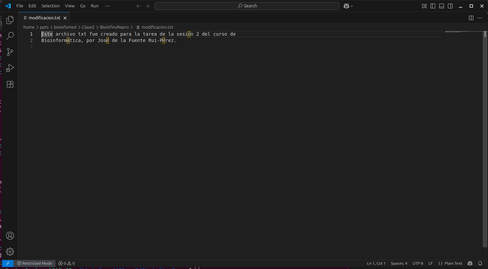
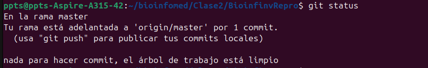
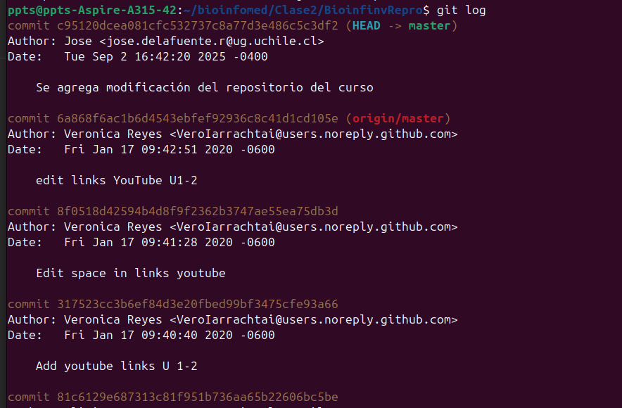

## Evidencia de las modificaciones

### Modifcación en archivo .txt

*Figura 1: Archivo modificado en el editor antes del commit.*

### Git status 

*Figura 2: Imagen del git status en mi maquina local después de realizado el commit.*

### Git Log 

*Figura 3: Imagen del git log luego de realizado el commit.*
